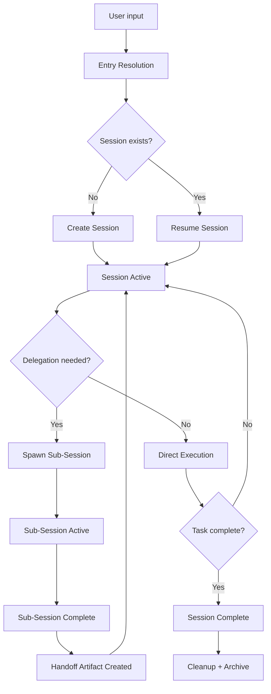

# Hivemind Architecture Synthesis — Strategic Redesign

> **Purpose**: Upstream strategic document for redesigning Hivemind's session, workflow, task, and state architecture by selectively learning from GSD, then adapting and improving those ideas for the opencode ecosystem.
>
> **Relationship**: This document is the prerequisite strategic foundation that must be reviewed and stabilized **before** executing [modernize-doc-intelligence-layer.md](file:///Users/apple/hivemind-plugin/docs/planning-draft/modernize-doc-intelligence-layer.md) or [tools-plugins-organized-structured.md](file:///Users/apple/hivemind-plugin/docs/synthesis/tools-plugins-organized-structured.md).

---

## 1. Comparative Analysis: GSD vs Hivemind

### 1.1 GSD Architecture Summary

GSD operates as a **CLI-tool-driven, markdown-native project management framework** for AI-assisted coding. Its key architectural primitives:

| Primitive | Implementation | Key Files |
|---|---|---|
| **State** | `STATE.md` — a single markdown file with YAML frontmatter sync. Human-readable, git-diffable. Fields extracted via regex. | `state.cjs`, `templates/state.md` |
| **Phases** | Numbered directory-based lifecycle (`01-setup/`, `02-implementation/`). Each phase contains plans and summaries. | `phase.cjs`, `core.cjs` |
| **Plans** | Individual task documents within phases. Numbered (`01-01-PLAN.md`), each has YAML frontmatter with `wave`, `depends_on`, `checkpoint` fields. | `verify.cjs` |
| **Roadmap** | `ROADMAP.md` — milestone-grouped phase listing with progress tables. Machine-parseable via regex. | `roadmap.cjs` |
| **Verification** | Structured checklist model: summary existence, file-mention spotcheck, commit verification, self-check section presence. | `verify.cjs` |
| **Config** | JSON config in `.planning/config.json` with dot-notation CRUD. User-level defaults in `~/.gsd/defaults.json`. | `config.cjs` |
| **Templates** | Markdown templates for all artifact types with placeholder variables. Template selection via content heuristics. | `template.cjs` |
| **Session** | Lightweight — `STATE.md` records session info (last session, stopped-at, resume file) but sessions are not first-class runtime objects. | `state.cjs: cmdStateRecordSession` |
| **Agents** | 12 specialized agents (planner, executor, verifier, debugger, etc.) defined as markdown files with clear role boundaries. | `agents/*.md` |
| **Commands** | 30+ slash commands mapping 1:1 to workflows. Each command file references a workflow. | `commands/gsd/*.md` |
| **Workflows** | 35 detailed multi-step procedures. Each is a comprehensive markdown document with conditional logic, tool call sequences, and verification gates. | `workflows/*.md` |

### 1.2 What GSD Gets Right

| Pattern | Description | Why It Works |
|---|---|---|
| **Markdown-as-state** | STATE.md is the single source of truth. Human-readable, git-trackable, grep-searchable. YAML frontmatter provides machine-readable layer without replacing markdown body. | Eliminates stale JSON, survives context rot, enables manual recovery |
| **Phase lifecycle** | Clear progression model: `planning → discussing → executing → verifying → paused → completed`. Status transitions are explicit and auditable. | Prevents ambiguous "what are we doing?" states |
| **Structured verification** | Verification is NOT a boolean. It checks: summary exists, file mentions match real files, commits exist, self-check section present, plan structure valid. | Catches real problems, not just "did it finish?" |
| **Template-driven scaffolding** | All artifacts start from templates. Templates carry structural expectations that downstream tools can verify. | Consistent structure enables reliable parsing |
| **Frontmatter sync** | `buildStateFrontmatter()` extracts machine-readable fields from markdown body and syncs them to YAML frontmatter. Writes always go through `writeStateMd()` which re-syncs. | Best of both worlds: human-readable body + machine-parseable header |
| **Progression engine** | State changes are driven through a progression engine with explicit advance/record/snapshot operations. | Prevents ad-hoc state mutations that cause drift |
| **Session recording** | Sessions record: last session, date, stopped-at position, resume file. This enables cold-start recovery. | Context continuity across interruptions |
| **Output buffering** | Large payloads write to tmpfile with `@file:` prefix for caller detection. Prevents buffer overflow in CLI tools. | Handles real-world scale |

### 1.3 What GSD Gets Wrong (for Hivemind's Context)

| Pattern | Problem | Why It Doesn't Fit Hivemind |
|---|---|---|
| **Regex-based field extraction** | `stateExtractField()` uses regex to parse markdown fields like `**Field:** value`. Fragile under formatting variations. | Hivemind needs robust AST-based parsing via `doc-weaver.ts` / remark |
| **Flat directory lifecycle** | Phases are numbered directories. Works for simple projects but doesn't support concurrent workstreams, parallel delegation waves, or branching task trees. | Hivemind's delegation model requires hierarchical task trees, not flat sequences |
| **No runtime session objects** | GSD sessions are just metadata in STATE.md. No session isolation, no concurrent sessions, no session-scoped state. | Hivemind already has (broken) session runtime — needs fixing, not removal |
| **CLI-first architecture** | Everything routes through `gsd-tools <action>` bash calls. Output is stdout text. No plugin hook API, no event system. | Hivemind operates inside OpenCode's plugin/hook ecosystem with typed APIs |
| **Single-project assumption** | One `.planning/` directory = one project. No multi-lineage, no framework-vs-product split. | Hivemind explicitly has dual-lineage (hivefiver framework + hiveminder product) |
| **No delegation framework** | GSD subagents are invoked but there's no structured handoff, no validation of sub-session outputs, no delegation recordkeeping. | Hivemind's core value proposition IS orchestrated delegation |
| **Monolithic STATE.md** | All state in one file. Works for small projects but becomes a bottleneck and conflict source with concurrent agents. | Hivemind needs partitioned state: session-scoped, task-scoped, and project-scoped |

---

## 2. Current Hivemind Ground Truth

### 2.1 Pollution Assessment

The `.hivemind/` directory has accumulated significant noise that indicates systemic architectural failures:

| Area | Problem | Severity | Evidence |
|---|---|---|---|
| `sessions/runtime/` | **69 abandoned `ses_*` directories** with no cleanup lifecycle | 🔴 Critical | Session creation has no corresponding teardown |
| [graph/orphans.json](file:///Users/apple/hivemind-plugin/.hivemind/graph/orphans.json) | **270KB** of orphaned graph nodes | 🟠 High | Graph mutations without garbage collection |
| [graph/tasks.json](file:///Users/apple/hivemind-plugin/.hivemind/graph/tasks.json) | **218KB** of task state | 🟠 High | Unbounded task accumulation without archival |
| [state/brain.json](file:///Users/apple/hivemind-plugin/.hivemind/state/brain.json) | **4 backup copies** alongside main | 🟡 Medium | Defensive copying instead of proper versioning |
| [logs/graph-io.log](file:///Users/apple/hivemind-plugin/.hivemind/logs/graph-io.log) | **714KB** single log file | 🟡 Medium | No log rotation or size management |
| `codemap/`, `codewiki/` | Empty stubs with only manifests | 🟡 Medium | Features scaffolded but never populated |
| `memory/` | Nearly empty | ⚪ Low | Feature placeholder |
| `plans/` | Empty | ⚪ Low | Feature placeholder |

### 2.2 Root Causes

1. **No session lifecycle**: Sessions are created but never cleaned up. There is no `session.end()`, no TTL, no garbage collection.
2. **JSON-as-state**: [brain.json](file:///Users/apple/hivemind-plugin/.hivemind/state/brain.json) is the primary state file — binary blob, not human-readable, not git-diffable, prone to corruption under concurrent writes.
3. **Dual injection conflict**: `.opencode/plugins/hiveops-governance/hooks/` and `src/hooks/` both modify per-turn context, creating contradictory injections. (Partially resolved — plugin disabled 2026-03-08)
4. **No artifact lifecycle**: Documents, tasks, and graph nodes are created but never archived, expired, or consolidated.
5. **State authority split**: State is fragmented across `brain.json`, `graph/*.json`, `hierarchy.json`, and session-scoped state files with no clear ownership model.

### 2.3 What Currently Works

| Component | Status | Notes |
|---|---|---|
| `doc-intel.ts` + `doc-weaver.ts` | ✅ Stable | AST-based markdown manipulation via remark. Solid foundation. |
| `hivemind_doc` V2 tool | ✅ Stable | 20 actions, swarm-safe writes, content hashing. |
| `hivemind_inspect.traverse` v1 | ✅ Active | Hierarchy-first navigation working. |
| Session bootstrap (`event-handler.ts`) | ⚠️ Improving | Fix 3B applied, child-session minimization active. |
| Path resolution (`paths.ts`) | ⚠️ Improving | Fix 3A applied. |
| Type checking | ✅ Passing | `npx tsc --noEmit` clean. |

---

## 3. Target Architecture

### 3.1 Core Design Principles

These are adapted from GSD's strengths but evolved for Hivemind's multi-agent, plugin-based, delegation-heavy context:

| # | Principle | GSD Origin | Hivemind Adaptation |
|---|---|---|---|
| 1 | **Markdown-as-primary-state** | STATE.md is the single source of truth | Adopt: Replace `brain.json` with `STATE.md` + domain-scoped markdown state files |
| 2 | **Session-as-atomic-unit** | GSD has weak sessions | Evolve: Sessions become the fundamental unit of coordinated execution with explicit lifecycle |
| 3 | **Structured verification** | Verify checklist model | Adopt + extend: Multi-level verification (plan-level, phase-level, session-level, delegation-level) |
| 4 | **Template-driven artifacts** | All artifacts from templates | Adopt: Standardize all `.hivemind/` artifacts from templates with YAML frontmatter |
| 5 | **Progression engine** | Explicit state transitions | Adapt: Replace phase-linear progression with delegation-wave progression |
| 6 | **Frontmatter sync** | YAML ↔ markdown body | Adopt directly: Machine-readable frontmatter synced from human-readable body |
| 7 | **Partitioned state** | GSD uses monolithic STATE.md | Evolve: Split state by scope — project, session, task, delegation |
| 8 | **Lifecycle everywhere** | GSD has lifecycle for phases only | Extend: Explicit create → active → complete → archive lifecycle for sessions, tasks, artifacts, and graph nodes |

### 3.2 Session Architecture

> **Core thesis**: A session is the atomic unit of coordinated execution. Every meaningful action happens within a session context.



#### Session State File: `.hivemind/sessions/active/{session_id}/SESSION.md`

Adapted from GSD's `STATE.md` template but scoped to sessions:

```markdown
---
session_id: ses_abc123
type: primary | sub | delegation
parent_session_id: null
agent: hiveminder | hivefiver | build | research | ...
lineage: framework | product
status: active | paused | complete | abandoned
created: 2026-03-13T10:00:00Z
updated: 2026-03-13T12:00:00Z
ttl_hours: 24
---

# Session: [Objective One-Liner]

## Context
**Lineage**: framework | product
**Agent**: hiveminder
**Parent**: none | ses_parent123
**Workflow**: research | implementation | audit | delegation

## Current Position
**Task**: 2 of 5
**Status**: executing
**Last Activity**: 2026-03-13T12:00:00Z — Completed auth middleware review

## Delegation Log
| Sub-Session | Agent | Objective | Status | Handoff |
|---|---|---|---|---|
| ses_def456 | build | Implement JWT fix | complete | handoffs/ses_def456.md |
| ses_ghi789 | research | Rate limiter analysis | active | — |

## Decisions
- [Task 1]: Chose JWT over session tokens for stateless auth
- [Task 2]: Rate limiter applied before auth middleware

## Blockers
None.

## Resume Context
**Stopped at**: Task 3 — Security audit of session.ts
**Next step**: Run hivemind_inspect.jsdoc on src/middleware/session.ts
**Key context**: JWT fix deployed in ses_def456, need to verify integration
```

#### Session Lifecycle

| State | Entry Condition | Exit Condition | Cleanup Action |
|---|---|---|---|
| Created | User input or delegation spawn | — | — |
| Active | Entry resolution completes | Task completion or delegation return | — |
| Paused | User explicit pause or context switch | User resume | State preserved |
| Complete | All tasks finished, verification passed | — | Archive to `sessions/archive/`, create summary |
| Abandoned | TTL expired, no activity | — | Archive with `abandoned` status, reclaim resources |

#### Session Cleanup (Adapted from GSD's gap)

GSD has no session cleanup — this is Hivemind's key innovation:

```
Session Cleanup Pipeline:
1. On session complete/abandon → write SUMMARY.md to session dir
2. Move session dir from active/ to archive/{date}/
3. If sub-sessions exist → verify all sub-session handoffs are filed
4. Purge any session-scoped temp files
5. Update project-level STATE.md with session outcome
6. If abandoned → log reason and last-known state for recovery
```

### 3.3 State Architecture

Replace the current `brain.json`-centric model with a **layered markdown state model** inspired by GSD but partitioned for Hivemind's multi-agent context.

#### State Layer Model

```
.hivemind/
├── STATE.md                          # Project-level state (adapted from GSD)
├── sessions/
│   ├── active/
│   │   └── ses_abc123/
│   │       ├── SESSION.md            # Session-level state
│   │       ├── tasks/
│   │       │   ├── 001-auth-audit.md # Task-level state
│   │       │   └── 002-jwt-fix.md
│   │       └── handoffs/
│   │           └── ses_def456.md     # Delegation handoff
│   └── archive/
│       └── 2026-03-13/
│           └── ses_old789/
│               ├── SESSION.md
│               ├── SUMMARY.md
│               └── tasks/
├── config/
│   └── config.json                   # Project config (adapted from GSD)
├── templates/
│   ├── session.md
│   ├── task.md
│   ├── handoff.md
│   └── summary.md
└── logs/
    └── state-transitions.log         # Append-only audit log
```

#### Project-Level STATE.md

Adapted directly from GSD's `STATE.md` template, but scoped to project-level concerns only (not session-level):

```markdown
---
project: hivemind-plugin
version: 3.3
status: active
active_sessions: 1
total_sessions: 72
last_activity: 2026-03-13T12:00:00Z
---

# Project State

## Current Focus
**Active lineage**: framework (hivefiver meta-builder healer refactor)
**Active workflow**: strategic-resync
**Priority**: Bootstrap and composition-first strategic resync on .hivemind formation

## Active Sessions
| Session | Agent | Objective | Started |
|---|---|---|---|
| ses_abc123 | hiveminder | Architecture synthesis | 2026-03-13T10:00:00Z |

## Recent Decisions
- [2026-03-08]: Disabled hiveops-governance plugin — src/hooks/ is sole governance owner
- [2026-03-06]: task_id continuity now persists through cycle capture/export

## Blockers
None active.

## Metrics
**Sessions completed**: 72
**Sessions abandoned**: 12 (16.7% abandon rate)
**Average session duration**: 45 min
```

#### State Authority Map

| Concern | Current Location | Target Location | Migration |
|---|---|---|---|
| Project status | `brain.json` | `STATE.md` | Extract and migrate |
| Session state | `sessions/runtime/ses_*/` (abandoned) | `sessions/active/ses_*/SESSION.md` | Rebuild from scratch |
| Task tracking | `graph/tasks.json` (218KB blob) | `sessions/active/ses_*/tasks/*.md` | Per-session task files |
| Orphan tracking | `graph/orphans.json` (270KB blob) | Eliminated by lifecycle cleanup | GC orphans on session close |
| Graph relationships | `graph/*.json` | Simplified: xref in frontmatter `related:` fields | Downsize to frontmatter-level |
| Config | `brain.json` fields | `config/config.json` (GSD-style JSON config) | Extract config fields |
| Hierarchy | `hierarchy.json` | Derived from session/task directory structure | Compute, don't store |

### 3.4 Task Architecture

Adapted from GSD's plan model but enhanced for delegation:

#### Task State File Template

```markdown
---
task_id: tsk_001
session_id: ses_abc123
type: research | implementation | audit | investigation | documentation
status: planned | active | blocked | complete | delegated
agent: build | research | verify | ...
wave: 1
depends_on: []
delegated_to: ses_def456 | null
created: 2026-03-13T10:00:00Z
completed: null
---

# Task: [Objective]

## Requirements
- [Requirement 1]
- [Requirement 2]

## Acceptance Criteria
- [ ] [Criterion 1]
- [ ] [Criterion 2]

## Execution Log
[Append-only log of actions taken]

## Verification
- [ ] Requirements met
- [ ] Acceptance criteria satisfied
- [ ] No regressions introduced
```

### 3.5 Workflow Architecture

GSD's workflow model is its strongest feature — comprehensive multi-step procedures with conditional logic and verification gates. Hivemind should adapt this but add delegation-awareness.

#### Workflow Categories (Adapted from GSD)

| Category | GSD Equivalent | Hivemind Adaptation |
|---|---|---|
| **Bootstrap** | `new-project`, `discovery-phase` | `hm-init`, `hm-doctor`, `hm-bootstrap` — includes lineage detection and dual-lineage setup |
| **Planning** | `plan-phase`, `discuss-phase` | `hm-plan` — adds delegation wave planning, spec distillation, and acceptance criteria |
| **Execution** | `execute-phase`, `execute-plan` | `hm-execute` — adds delegation spawning, sub-session monitoring, and handoff validation |
| **Verification** | `verify-phase`, `verify-work` | `hm-verify` — adds multi-level verification (plan, phase, session, delegation) |
| **State Management** | `progress`, `health`, `resume-work`, `pause-work` | `hm-status`, `hm-health`, `hm-resume`, `hm-pause` — adds session lifecycle management |
| **Cleanup** | `cleanup` | `hm-cleanup` — adds session GC, orphan purge, archive management, log rotation |
| **Delegation** | *(none — GSD gap)* | `hm-delegate`, `hm-handoff` — new: structured delegation with handoff artifact creation |

#### Workflow Structure (Adapted from GSD Format)

GSD workflows are comprehensive markdown documents. Hivemind should use the same format but with delegation-aware extensions:

```markdown
---
name: hm-execute
description: Execute a planned task within the current session
requires: active session, planned task
agents: [build, research, verify]
---

# Execute Task

## Pre-conditions
1. Active session exists (check SESSION.md status = active)
2. Task is in `planned` status
3. Dependencies are met (all `depends_on` tasks are `complete`)

## Steps

### Step 1: Load Context
- Read SESSION.md for session context
- Read task file for requirements and acceptance criteria
- If task has `delegated_to`, check sub-session status first

### Step 2: Evaluate Delegation Need
- If task complexity exceeds single-agent scope → delegate via hm-delegate
- If task requires specialized agent → spawn sub-session

### Step 3: Execute
- Update task status to `active`
- Execute task requirements
- Append execution log entries

### Step 4: Verify
- Run acceptance criteria checks
- If verification fails → update status to `blocked` with reason
- If verification passes → update status to `complete`

### Step 5: Record
- Update SESSION.md current position
- Update project STATE.md if milestone reached
- If delegated sub-sessions exist, validate all handoffs filed

## Error Recovery
- If session is interrupted → task remains `active`, resume from execution log
- If sub-session fails → mark delegation as `failed`, assess retry or escalate
```

---

## 4. Adapt/Reject/Evolve Decisions

### 4.1 Patterns to Adopt from GSD

| Pattern | What to Adopt | How |
|---|---|---|
| **Markdown-as-state** | Replace `brain.json` with `STATE.md` | Create `STATE.md` template, migrate key fields, deprecate `brain.json` |
| **YAML frontmatter sync** | All `.hivemind/` markdown files get synced frontmatter | Use `doc-weaver.ts` for AST-based sync (superior to GSD's regex) |
| **Template-driven scaffolding** | All artifacts created from templates | Create `templates/` directory with session, task, handoff, summary templates |
| **Structured verification** | Multi-check verification model | Extend GSD's 4-check model to include delegation verification |
| **Session recording** | Record session info for cold-start recovery | Implement in SESSION.md with resume context section |
| **Progression engine** | Explicit state transitions with audit trail | Implement in `state-engine.ts` with append-only transition log |
| **Output buffering** | Large payload → tmpfile with `@file:` prefix | Already partially implemented; standardize across all tools |

### 4.2 Patterns to Reject from GSD

| Pattern | Why Reject | Hivemind Alternative |
|---|---|---|
| **Regex field extraction** | Fragile, fails on formatting variations | Use remark AST via `doc-weaver.ts` |
| **Flat numbered phases** | Can't represent delegation trees or concurrent workstreams | Hierarchical session/task tree |
| **Monolithic STATE.md** | Single file bottleneck under concurrent agents | Partitioned state: project, session, task scopes |
| **CLI-first routing** | Hivemind operates inside OpenCode plugin system | Plugin hooks + custom tools |
| **No delegation model** | GSD's biggest architectural gap | Full delegation framework with handoff artifacts |
| **Global config only** | No session-scoped or agent-scoped config | Layered config: project → session → agent |

### 4.3 Patterns to Evolve Beyond GSD

| GSD Pattern | Hivemind Evolution |
|---|---|
| **Phase lifecycle** → | **Session lifecycle**: create → active → paused → complete → archived, with TTL-based abandonment |
| **Plan structure** → | **Task structure**: adds delegation fields, acceptance criteria, wave assignments, agent routing |
| **Verify summary** → | **Multi-level verification**: task-level (acceptance criteria), session-level (all tasks complete), delegation-level (all handoffs validated), project-level (milestone gates) |
| **ROADMAP.md** → | **Planning hierarchy**: `.hivemind/project/planning/` with phase, milestone, and sprint organization |
| **Session recording** → | **Full session lifecycle**: not just recording but active management — create, pause, resume, complete, abandon, cleanup, archive |
| **Template selection** → | **Intelligent scaffolding**: template selection based on lineage, agent profile, workflow type, and project stage |

---

## 5. Migration Strategy

### 5.1 Phase 1: Cleanup (Prerequisite)

> **Goal**: Eliminate the 69 orphaned sessions and accumulated pollution before building new architecture.

| Action | Target | Method |
|---|---|---|
| Purge orphaned sessions | `sessions/runtime/ses_*` (69 dirs) | Archive any with meaningful content, delete the rest |
| Compact graph files | `graph/orphans.json` (270KB), `graph/tasks.json` (218KB) | Extract any referenced data, archive originals, create clean versions |
| Remove brain.json backups | `state/brain.json.backup*` (4 files) | Delete — backups indicate a broken versioning model |
| Rotate logs | `logs/graph-io.log` (714KB) | Implement log rotation, archive current |
| Remove empty stubs | `codemap/`, `codewiki/`, `memory/`, `plans/` | Delete if truly empty; document why they existed |

### 5.2 Phase 2: State Migration

> **Goal**: Replace `brain.json` with markdown state files.

1. Create `STATE.md` template from GSD's template (adapted)
2. Extract project-level fields from `brain.json` into `STATE.md`
3. Extract config fields from `brain.json` into `config/config.json`
4. Deprecate `brain.json` reads in `src/hooks/` — point to new state files
5. Implement `writeStateMd()`-style sync function using `doc-weaver.ts`

### 5.3 Phase 3: Session Architecture

> **Goal**: Implement proper session lifecycle.

1. Define SESSION.md template
2. Implement session create/resume/pause/complete/abandon lifecycle
3. Implement TTL-based session abandonment (default 24h)
4. Implement session cleanup pipeline
5. Migrate `event-handler.ts` bootstrap to use new session lifecycle

### 5.4 Phase 4: Delegation Framework

> **Goal**: Enable structured delegation with handoff artifacts.

This phase directly enables [modernize-doc-intelligence-layer.md](file:///Users/apple/hivemind-plugin/docs/planning-draft/modernize-doc-intelligence-layer.md)'s `hivemind-handoff` tool family.

1. Define handoff artifact schema and templates
2. Implement delegation spawn → sub-session → handoff → validation pipeline
3. Wire delegation lifecycle into session state management
4. Create `hm-delegate` workflow

### 5.5 Phase 5: Workflow Conversion

> **Goal**: Convert critical workflows to the new architecture.

Priority order:
1. `hm-init` / `hm-doctor` (bootstrap)
2. `hm-status` / `hm-health` (observability)
3. `hm-cleanup` (maintenance)
4. `hm-plan` / `hm-execute` / `hm-verify` (core loop)
5. `hm-delegate` / `hm-handoff` (delegation)

---

## 6. Relationship to Downstream Plans

### 6.1 How This Enables `modernize-doc-intelligence-layer.md`

| This Synthesis Provides | Doc Intelligence Layer Needs |
|---|---|
| Session lifecycle model | Handoff artifacts need session context |
| Markdown-as-state pattern | All 3 tool families operate on markdown |
| Template-driven scaffolding | `hivemind_handoff.create` uses templates |
| Frontmatter sync model | All tools read/write YAML frontmatter |
| Partitioned state model | `hivemind_inspect` needs to know where state lives |
| Verification framework | `hivemind_handoff.validate` needs verification criteria |

### 6.2 How This Enables `tools-plugins-organized-structured.md`

| This Synthesis Provides | Tool Suite Implementation Needs |
|---|---|
| State file locations | Tool routing knows where to read/write |
| Session-scoped paths | Tools resolve paths relative to active session |
| Handoff schema | `hivemind_handoff` tool contract matches session architecture |
| Artifact conventions | Naming, frontmatter, and hierarchy conventions are defined |
| Lifecycle hooks | Tool actions can trigger lifecycle events (session pause, task complete) |

---

## 7. Open Questions for User Decision

> [!IMPORTANT]
> These require explicit user input before implementation can proceed.

1. **Brain.json deprecation timeline**: Should `brain.json` be deprecated immediately (hard cutover) or maintained as a compatibility shim during migration?

2. **Session TTL default**: What should the default TTL for abandoned session detection be? (Proposed: 24 hours, but this affects cleanup aggressiveness)

3. **Graph data**: The 270KB `orphans.json` and 218KB `tasks.json` — should any data be extracted/preserved before cleanup, or is it all noise from the contamination period?

4. **Dual-lineage session isolation**: When hivefiver (framework) and hiveminder (product) sessions run concurrently, should they share project-level `STATE.md` or have lineage-scoped state files?

5. **Migration ordering**: Should cleanup (Phase 1) happen in this conversation, or be deferred to a separate session with explicit verification?

6. **Codex/Framework sidecar surfaces**: `.codex/**` and `docs/framework/**` — should these be addressed in Phase 1 cleanup or remain untouched as optional mirrors?
