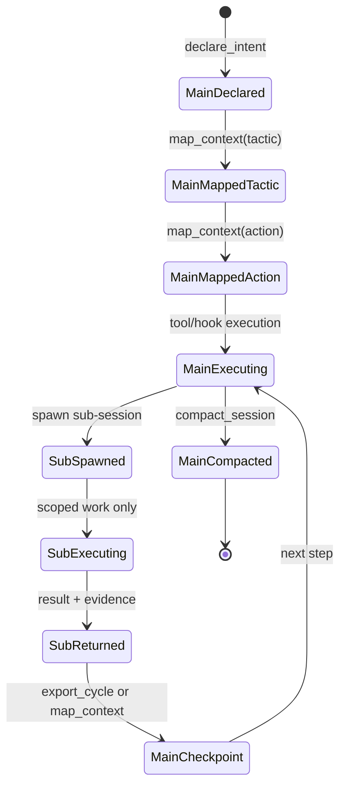
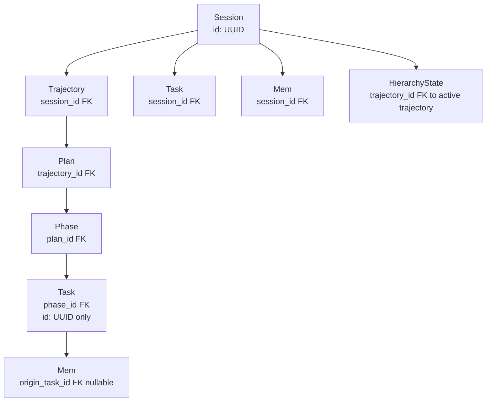
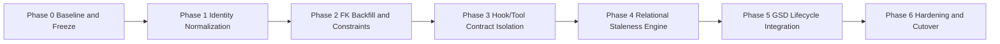

# Unified Master Architecture Plan: Entity Relationships, Automation, and GSD Lifecycle

Date: 2026-02-19  
Scope: Documentation-only consolidation for execution planning  
Primary artifact: `docs/plans/2026-02-19-entity-relationship-remediation.md`

## Executive Context

This plan unifies three previously fragmented tracks into one dependency-ordered architecture program:
1. Entity relationship remediation and FK correctness.
2. Hook/tool automation contracts and overlap containment.
3. GSD-aligned lifecycle from project to verification.

Ground truth captured from current architecture:
- Task IDs are mixed (`sequential` and `UUID`), causing broken joins (`task.id` versus `origin_task_id`).
- `mem -> session` FK is missing in critical paths, so session-scoped retrieval is unreliable.
- Hierarchy lineage is detached from graph lineage (`state/*` not fully keyed to `graph/*`).
- Memory data is split across multiple paths, producing inconsistent reads and stale inference.
- Hook overlap risk exists between `src/hooks/session-lifecycle.ts` and `src/hooks/messages-transform.ts`.

Program objective: make `graph/*` the relational source of truth (SOT), keep `state/*` as runtime hot state, and enforce staleness evaluation only within valid lineage and same-level context.

## Current-State Architecture (As-Is)

Current files and roles:
- `src/schemas/graph-nodes.ts`: graph entities and intended FK model.
- `src/schemas/brain-state.ts`: runtime session state.
- `src/schemas/hierarchy.ts`: trajectory/tactic/action runtime view.
- `src/lib/staleness.ts`: current staleness logic, still partly timestamp-first.
- `src/lib/cognitive-packer.ts`: retrieval assembly and filtering pipeline.
- `src/lib/graph-io.ts`, `src/lib/graph-migrate.ts`: graph persistence and migration.
- `src/hooks/session-lifecycle.ts`, `src/hooks/messages-transform.ts`: context injection and turn transforms.
- `src/tools/hivemind-session.ts`, `src/tools/hivemind-memory.ts`, `src/tools/hivemind-inspect.ts`: write-path entrypoints.

As-is constraints:
- Relationship checks are incomplete when IDs are mixed format.
- Retrieval behavior can diverge because hook responsibilities overlap.
- Some decisions are inferred from recency alone, even when lineage is absent.

## Hook & Tool Retrieval Contract

Contract principle: tools perform state mutation (write path), hooks perform context retrieval/injection (read path), and both must not duplicate ownership.

| Trigger | Owner | Input | Output | Must Not Do | Verification Signal |
|---|---|---|---|---|---|
| Session start/update/close | `src/tools/hivemind-session.ts` | user intent + mode | persisted session records | inject retrieval payload | session record created/updated |
| Turn pre-injection | `src/hooks/session-lifecycle.ts` | active session + hierarchy cursor | `<hivemind_state>` context block | mutate graph entities | state injection contains lineage ids |
| Message normalization | `src/hooks/messages-transform.ts` | inbound/outbound messages | transformed message text | perform lifecycle retrieval selection | no overlap with lifecycle retrieval logs |
| Memory write/read calls | `src/tools/hivemind-memory.ts` | shelf/content/query | mem nodes + query results | evaluate staleness policy in tool layer | mem rows carry valid FK fields |
| State inspection calls | `src/tools/hivemind-inspect.ts` | scan/deep/drift action | diagnostic snapshot | alter SOT entities | scan output reflects graph lineage |

Overlap risk and containment:
- Risk: both `src/hooks/session-lifecycle.ts` and `src/hooks/messages-transform.ts` influencing retrieval ordering.
- Mitigation: lifecycle hook owns retrieval orchestration; messages-transform is text-shaping only.
- Enforcement: add explicit contract tests in later implementation phase to fail on duplicate retrieval ownership.

## Session Lifecycle Model (Main vs Sub-session)

Operational model:
- Main session owns global trajectory/tactic/action and acceptance decisions.
- Sub-session owns bounded work package and returns evidence only.
- Every sub-session return must be checkpointed before next action.

## Source of Truth (SOT) Contract

| Data Domain | Primary SOT | Secondary/Cache | Write Owner | Read Owner | Notes |
|---|---|---|---|---|---|
| Entity graph (`session/trajectory/plan/phase/task/mem`) | `graph/*` via `src/lib/graph-io.ts` | none | tools via graph libs | hooks and tools | Relational integrity required |
| Runtime activity and turn counters | `state/*` (`brain.json`, hierarchy state) | derived in memory | tools + controlled runtime | hooks | Hot operational state only |
| Injected context payload | derived from `graph/*` + `state/*` | none | none (derived) | `src/hooks/session-lifecycle.ts` | Not persisted as SOT |
| Migration metadata | `state/manifest*` and migration records | none | migration routines | inspect tools | Must map legacy -> graph IDs |

SOT boundary rules:
- `graph/*` is canonical for identity and relationships.
- `state/*` is canonical for current runtime cursor and ephemeral telemetry.
- No hook may persist identity changes directly to `graph/*`; identity writes remain in tool/lib write path.

## Entity Relationship Contract (Target)

Target lineage: `Session -> Trajectory -> Plan -> Phase -> Task -> Mem` with UUID keys and explicit FK edges.

Mandatory contract decisions:
- Task IDs must be UUID-only; sequential task IDs are legacy and blocked at write time.
- `mem.session_id` is mandatory for all new and migrated records.
- `mem.origin_task_id` is nullable but, when present, must reference UUID task IDs.
- Hierarchy state must map to active trajectory identity, not free-text only.

## Staleness Semantics (Relational, not Timestamp-first)

Staleness evaluation order:
1. Validate lineage context first (same session and same active branch level).
2. Validate task linkage (`origin_task_id` against active task set).
3. Apply semantic flags (`false_path`, user discard, superseded).
4. Use timestamps only as fallback tie-breakers.

Rules:
- Never mark stale solely by age if lineage is active and same-level relevant.
- Only compare staleness among entities that share valid lineage scope.
- Cross-session timestamp comparisons are informational, not authoritative.

## Unified Master Roadmap (Phases 0-6)

### Dependency Graph

### Phase Plan (non-overlapping gates)

- Phase 0 - Baseline and Freeze
  - Capture current behavior snapshots and migration inventory.
  - Freeze schema-affecting writes except approved migration routines.
  - Exit gate: baseline evidence approved and rollback snapshot complete.

- Phase 1 - Identity Normalization
  - Convert task identity policy to UUID-only and map legacy sequential IDs.
  - Build deterministic ID mapping table for legacy references.
  - Exit gate: no sequential task IDs in active data paths.

- Phase 2 - FK Backfill and Constraints
  - Backfill `mem.session_id`, repair `origin_task_id`, attach hierarchy lineage.
  - Enforce FK validation in schema and migration checks.
  - Exit gate: FK validation pass and orphan set accounted for.

- Phase 3 - Hook/Tool Contract Isolation
  - Separate retrieval ownership (`session-lifecycle`) from message shaping (`messages-transform`).
  - Add overlap guardrails and contract tests.
  - Exit gate: single retrieval owner proven by test and trace evidence.

- Phase 4 - Relational Staleness Engine
  - Implement lineage-first staleness semantics in retrieval pipeline.
  - Keep timestamp fallback only for same-lineage tie-breakers.
  - Exit gate: staleness fixtures pass for same-lineage and cross-lineage cases.

  #### Phase 4 Planning Record (2026-02-19)

  Requirements summary:
  - Lineage-first evaluation before any timestamp comparison.
  - Same-level scope constraints for stale/non-stale comparison sets.
  - Timestamp tie-breaker only after lineage and semantic checks are satisfied.
  - Semantic precedence for false_path, discard, and superseded signals.
  - Cross-session comparisons are informational only and must not drive stale authority.

  Acceptance criteria (completed):
  - [x] AC1: Lineage-first gating enforced in staleness evaluation entry path.
  - [x] AC2: Same-level scope filter applied before stale ranking.
  - [x] AC3: Timestamp ordering executes only as final tie-breaker within valid scope.
  - [x] AC4: Semantic flags override recency when conflict exists.
  - [x] AC5: Cross-session stale checks are marked informational and non-authoritative.
  - [x] AC6: Regression tests cover lineage-valid, lineage-invalid, and mixed-session cases.

  Note: Implementation complete and approved; Phase 4 exit gate passed.

  Phase 4 Exit Gate Evidence:
  - Tests: `npm test` pass (0 failures).
  - TypeScript: `npx tsc --noEmit` pass (0 errors).
  - Code-review: approved (final sign-off).

- Phase 5 - GSD Lifecycle Integration
  - Align entities with lifecycle levels (`project/milestone/phase/plan/task/verification`).
  - Ensure planning/verification records are lineage-linked and queryable.
  - Exit gate: end-to-end lifecycle trace from project to verification artifact.

- Phase 6 - Hardening and Cutover
  - Run migration rehearsals, defect burn-down, and observability checks.
  - Declare graph relational path as production read authority.
  - Exit gate: no critical defects, rollback validated, governance sign-off complete.

### Phase Gate Checklist

| Phase | Entry Gate | Checkpoint Evidence | Exit Gate | Rollback Trigger |
|---|---|---|---|---|
| 0 | scope approved | baseline snapshots + inventory | freeze complete | missing baseline parity |
| 1 | freeze active | legacy-to-UUID map generated | UUID-only task policy active | unresolved ID collisions |
| 2 | UUID policy active | FK backfill reports + orphan ledger | FK checks pass | orphan growth above threshold |
| 3 | FK checks pass | hook ownership trace + contract tests | overlap eliminated | duplicate retrieval ownership |
| 4 | hook isolation stable | lineage-first staleness test results | timestamp-first paths removed | false stale positives |
| 5 | staleness stable | lifecycle trace reports | project->verification trace complete | broken lifecycle lineage |
| 6 | lifecycle complete | cutover rehearsal + monitoring | sign-off and cutover | rollback drill fails |

## Verification & Governance Gates

Verification stack per phase:
- Structure and schema integrity checks (`graph` entity validation and FK assertions).
- Retrieval trace checks proving hook/tool boundary compliance.
- Lifecycle trace checks proving `project -> milestone -> phase -> plan -> task -> verification` continuity.

Governance checkpoints:
- At phase start: checkpoint context with lifecycle objective and risks.
- At phase end: checkpoint evidence, unresolved issues, and go/no-go decision.
- On blocked/failure condition: immediate blocked status update before proceeding.

## Migration Strategy (Legacy -> Graph)

Migration tracks:
1. Identity migration: sequential task IDs to UUID with deterministic mapping.
2. FK migration: add and backfill `session_id`, `trajectory_id`, and task lineage links.
3. Retrieval migration: shift from mixed timestamp filters to lineage-first filters.

Execution strategy:
- Use dual-read during migration windows: legacy read allowed, graph write canonical.
- Run idempotent migration steps so retries are safe.
- Quarantine unresolved orphans with explicit ledger and remediation queue.

Rollback strategy:
- Rollback point per phase tied to pre-phase snapshot.
- If phase gate fails, revert to previous approved snapshot and replay only validated migrations.
- Never roll back partially without replaying deterministic mapping artifacts.

## Risk Register and Mitigations

| Risk | Impact | Likelihood | Mitigation | Owner Signal |
|---|---|---|---|---|
| Sequential/UUID mixed IDs persist | broken joins and stale false positives | High | enforce UUID at write boundary + migration map | zero sequential IDs in active reads |
| Missing `mem.session_id` after migration | session retrieval corruption | High | mandatory backfill with audit report | 100% mem rows have session FK |
| Hook overlap (`session-lifecycle` vs `messages-transform`) | duplicate retrieval and drift | Medium | strict retrieval ownership and tests | one hook owns retrieval path |
| Split memory paths continue | inconsistent context injection | Medium | route reads through graph relational layer | single memory query contract |
| Hierarchy remains detached | tactic/action mismatch with graph | Medium | bind hierarchy to trajectory FK | hierarchy-to-trajectory checks pass |
| Timestamp-first logic reintroduced | regression in relevance quality | Medium | regression tests for lineage-first ordering | no failing staleness regression tests |

## Operating Playbook (Per Turn / Per Phase / Per Milestone)

Per turn:
- Validate active trajectory/tactic/action cursor before executing work.
- Execute only actions that preserve hook/tool ownership boundaries.
- Record blocked/failure states immediately with explicit checkpoint status.

Per phase:
- Confirm entry gate, run scoped tasks, produce checkpoint evidence.
- Reject phase completion without gate evidence and rollback readiness.
- Maintain dependency order; do not overlap phases.

Per milestone:
- Confirm all child phases are closed with evidence.
- Validate lifecycle trace continuity up to verification entities.
- Decide promote/hold/rollback based on gate checklist outcomes.

## Done Criteria

This unified program is done only when all criteria are true:
- Entity graph enforces UUID identity and required FK relationships across session, hierarchy, task, and mem.
- Retrieval contract is stable with no ownership overlap between `src/hooks/session-lifecycle.ts` and `src/hooks/messages-transform.ts`.
- `graph/*` is authoritative for relational identity; `state/*` is runtime-only hot state.
- Staleness is lineage-first and same-level constrained, with timestamps as fallback only.
- GSD lifecycle (`project/milestone/phase/plan/task/verification`) is lineage-linked and verifiable end-to-end.
- Each phase (0-6) has passed gates with checkpoint evidence and validated rollback path.

---

## Phase 2 Completion Record (2026-02-19)

### Implementation Summary
| Item | File | Line | Status |
|------|------|------|--------|
| MemNodeSchema.session_id FK | graph-nodes.ts | 47 | ✅ COMPLETE |
| cognitive-packer session_id | cognitive-packer.ts | 256 | ✅ COMPLETE |
| session-swarm session_id | session-swarm.ts | 311 | ✅ COMPLETE |
| session-swarm UUID fix | session-swarm.ts | 311 | ✅ COMPLETE |
| session-swarm Zod validation | session-swarm.ts | 324 | ✅ COMPLETE |
| migrateMems session_id | graph-migrate.ts | 537 | ✅ COMPLETE |
| backfillMemSessionId() | graph-migrate.ts | 506 | ✅ COMPLETE |

### Exit Gate Evidence
- TypeScript session_id errors: 0 ✅
- Test suite graph-migrate: PASS ✅
- Code-review: APPROVED ✅

### Remaining Work (Phase 4+)
- Relational staleness engine (Phase 4)
- GSD lifecycle integration (Phase 5)
- Hardening and cutover (Phase 6)

---

## Phase 3 Implementation Record (2026-02-19)

### Violations Identified
| # | Violation | File | Line | Severity |
|---|-----------|------|------|----------|
| 1 | CQRS Violation | session-lifecycle.ts | 73 | HIGH |
| 2 | Missing FK Validation | graph-io.ts | 279 | HIGH |
| 3 | Retrieval Overlap | session-lifecycle.ts + messages-transform.ts | - | MEDIUM |
| 4 | Line Count Exceeded | messages-transform.ts | 489 lines | LOW |

### Implementation Tasks
| Task | Status | Evidence |
|------|--------|----------|
| Fix CQRS violation (queueStateMutation) | COMPLETE | Hook-side flush ownership removed in `src/hooks/soft-governance.ts` and `src/hooks/compaction.ts` |
| Add session_id FK validation | COMPLETE | `mem.session_id` validation added in `src/lib/graph-io.ts` |
| Enforce retrieval ownership | COMPLETE | Retrieval ownership isolated to lifecycle path; overlap removed |
| Add contract tests | COMPLETE | Final sign-off review completed with scanner/explore corroboration |

### Exit Gate Criteria
- [x] TypeScript: 0 errors
- [x] Tests: npm test passes
- [x] Code-review: Approved
- [x] Contract tests: Pass

### Exit Gate Evidence
- TypeScript: `npx tsc --noEmit` pass (0 errors)
- Tests: `npm test` pass (0 failures)
- Code-review: APPROVED (final sign-off)
- Contract isolation: hook-side flush ownership removed in `src/hooks/soft-governance.ts` and `src/hooks/compaction.ts`
- FK validation: `mem.session_id` validation in `src/lib/graph-io.ts`
