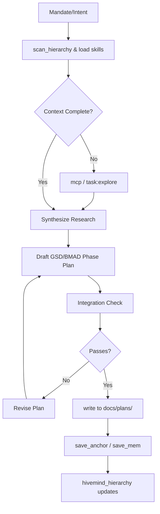

# HivePlanner Architecture Design
Date: 2026-02-24
Status: Draft -> Active

## 1. Overview
The `hiveplanner` agent is a specialized subagent/primary agent focused exclusively on **phase-planning, deep research, and integration checking**. It bridges the gap between high-level architectural mandates (from `hiveminder` or user) and execution tasks (for `build`, `code-review`).

It incorporates the methodologies of BMAD (complex domain mapping) and GSD (lifecycle: project/milestone/phase/plan/task/verification) while strictly adhering to HiveMind Context Governance.

## 2. Agent Identity & Responsibilities
- **Role:** Phase-Planning Agent & Research Expert.
- **Core Loop:** Intake Mandate -> Research (MCP) -> Draft Plan (GSD/BMAD format) -> Validate Integration -> Delegate or Return.
- **Constraints:** 
  - NO editing of `src/` code files. 
  - Write permissions restricted to `docs/plans/`, `.planning/`, and `.opencode/` for scaffolding.
  - Must rely on subagents (`scanner`, `explore`) or MCP tools for deep code intelligence.
- **Document Expert:** Writes standardized, deterministic XML/Markdown artifacts (PRDs, Phase Plans, Knots).

## 3. Architecture & Components

### 3.1 Toolset & Access
| Category | Tools | Purpose |
|----------|-------|---------|
| **Governance** | `hivemind_session`, `hivemind_inspect`, `hivemind_hierarchy` | Enforce context-first protocol. Tree management. |
| **Cognitive** | `save_anchor`, `save_mem`, `scan_hierarchy`, `think_back` | Maintain alignment and persistence across sessions. |
| **Research** | `mcp`, `websearch`, `tavily`, `exa`, `deepwiki` | External grounding, framework research, and fact-checking. |
| **Delegation** | `task`, `hivemind_cycle` | Spawn `scanner` or `explore` subagents for codebase mapping. |
| **I/O** | `read`, `write`, `edit`, `glob`, `grep` | Read source, write planning documents. |

### 3.2 Diagram: Execution Flow

### 3.3 Skill Integrations
`hiveplanner` utilizes the following skills inherently:
- `hivemind-governance`: Checkpoint enforcement.
- `hivefiver-mcp-research-loop`: Evidence-backed research.
- `planning-with-files`: Manus-style file-based planning and state management.
- `hivefiver-gsd-compat`: Mapping outputs to GSD checkpoints.

## 4. Trade-offs & Patterns
- **Trade-off: No `src/` write access.** 
  - *Pros:* Prevents the planner from hallucinating code or breaking the build. Forces pure orchestration and planning.
  - *Cons:* Slower execution if minor code fixes are needed (must delegate).
- **Pattern: Evidence-first Claiming.**
  - `hiveplanner` cannot output a plan without citing the file paths (from `glob`/`read`) or URLs (from `mcp`) that justify the architectural decision.
- **Pattern: The "Knot" Structure.**
  - Plans are generated as "Knots" (1-5 execution blocks) that directly map Trajectories to Actions in the HiveMind hierarchy.

## 5. Next Steps
1. Create `.opencode/agents/hiveplanner.md` defining the system prompt, tools, and permissions.
2. (Optional) Create a specific workflow script/skill if the existing ones are insufficient.