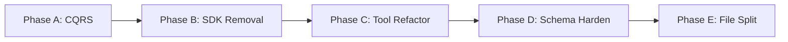
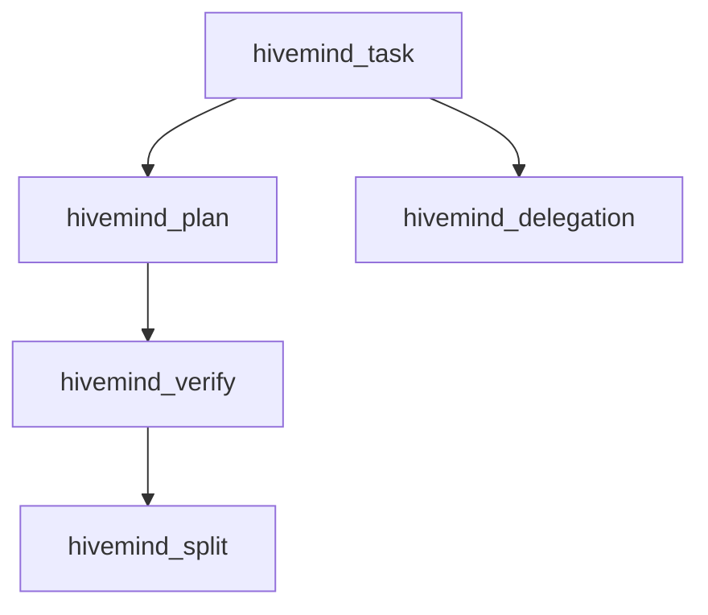
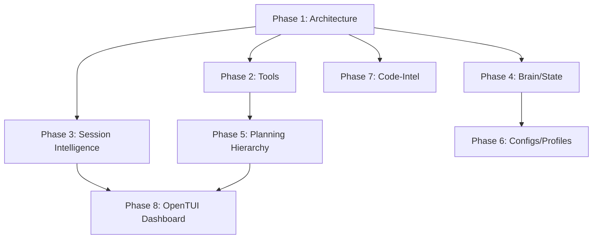

# HiveMind v3.0 Consolidated Roadmap

> **Date:** 2026-02-25
> **Session:** 58a87b13-ea01-4cea-a956-73b16396d8ed
> **Source:** Investigation streams (50 planning docs, 97 src files, 114 ecosystem files)
> **Baseline:** 181 tests pass, 0 tsc errors, branch dev-v3
> **Philosophy:** "Context-first, evidence-gated, incremental delivery with zero regression"

---

## Executive Summary

### Current State

| Metric | Value | Target |
|--------|-------|--------|
| **Source Files** | 97 (~25K LOC) | ~120 files |
| **Architecture Health** | 85/100 | 95/100 |
| **CQRS Compliance** | 54% (hooks) | 100% |
| **Tool Coverage** | 6 canonical tools | 10+ tools |
| **Test Coverage** | 181 tests | 250+ tests |
| **Code-Intel** | Phases 1-3 complete | Phase 4 (cognitive integration) |

### Target State (v3.0)

```
┌─────────────────────────────────────────────────────────────────┐
│                    HiveMind v3.0 Architecture                   │
├─────────────────────────────────────────────────────────────────┤
│  ORCHESTRATION LAYER                                           │
│  ┌─────────────┐ ┌─────────────┐ ┌─────────────┐               │
│  │ hivefiver   │ │ hiveplanner │ │ hiveminder  │               │
│  │ (meta)      │ │ (planning)  │ │ (orchestr.) │               │
│  └─────────────┘ └─────────────┘ └─────────────┘               │
├─────────────────────────────────────────────────────────────────┤
│  TOOLS LAYER (Write-Only)                                      │
│  ┌──────────┐ ┌──────────┐ ┌──────────┐ ┌──────────┐           │
│  │ session  │ │ memory   │ │ task     │ │ plan     │           │
│  └──────────┘ └──────────┘ └──────────┘ └──────────┘           │
│  ┌──────────┐ ┌──────────┐ ┌──────────┐ ┌──────────┐           │
│  │ verify   │ │ delegate │ │ split    │ │ codemap  │           │
│  └──────────┘ └──────────┘ └──────────┘ └──────────┘           │
├─────────────────────────────────────────────────────────────────┤
│  HOOKS LAYER (Read-Auto)                                       │
│  ┌────────────────┐ ┌────────────────┐ ┌────────────────┐       │
│  │ lifecycle      │ │ governance     │ │ context-doctor │       │
│  └────────────────┘ └────────────────┘ └────────────────┘       │
├─────────────────────────────────────────────────────────────────┤
│  LIBRARIES LAYER (Pure TS)                                     │
│  ┌─────────────┐ ┌─────────────┐ ┌─────────────┐               │
│  │ graph-io    │ │ cognitive-  │ │ code-intel  │               │
│  │ (FK-valid)  │ │ packer      │ │ (tree-sitter)│              │
│  └─────────────┘ └─────────────┘ └─────────────┘               │
├─────────────────────────────────────────────────────────────────┤
│  SCHEMAS LAYER (Zod DNA)                                       │
│  ┌─────────────┐ ┌─────────────┐ ┌─────────────┐               │
│  │ graph-nodes │ │ brain-state │ │ config      │               │
│  └─────────────┘ └─────────────┘ └─────────────┘               │
└─────────────────────────────────────────────────────────────────┘
```

---

## Phase Breakdown

### Phase 1: Architecture Remediation (CRITICAL)

**Goal:** Fix CQRS violations and architectural debt
**Duration:** 2 sessions
**Prerequisites:** Current baseline (181 tests pass)



#### Phase 1A: CQRS Enforcement
| Task | Scope | LOC | Dependencies |
|------|-------|-----|--------------|
| T1A-01 | Wire state-mutation-queue into soft-governance.ts | ~30 | None |
| T1A-02 | Wire into messages-transform.ts | ~20 | T1A-01 |
| T1A-03 | Wire into tool-gate.ts | ~20 | T1A-01 |
| T1A-04 | Wire into event-handler.ts | ~15 | T1A-01 |
| T1A-05 | Wire into compaction.ts | ~15 | T1A-01 |
| T1A-06 | Add flushMutations() to hivemind-session tools | ~25 | T1A-01..05 |

**Acceptance Criteria:**
- [ ] All hooks use state-mutation-queue (no direct stateManager.save())
- [ ] Tools flush mutations on write operations
- [ ] Zero `stateManager.save()` imports in hooks/
- [ ] Tests verify CQRS compliance

#### Phase 1B: SDK Dependency Removal
| Task | Scope | LOC | Dependencies |
|------|-------|-----|--------------|
| T1B-01 | Move SDK session from compaction-engine.ts to hooks | ~40 | T1A-06 |
| T1B-02 | Move SDK shell from auto-commit.ts to hooks | ~30 | T1A-06 |
| T1B-03 | Verify lib/ has zero SDK imports | ~0 | T1B-01, T1B-02 |

**Acceptance Criteria:**
- [ ] lib/ contains only pure TypeScript (no SDK imports)
- [ ] All SDK access through hooks layer
- [ ] Tests pass with refactored imports

#### Phase 1C: Tool Refactoring
| Task | Scope | LOC | Dependencies |
|------|-------|-----|--------------|
| T1C-01 | Create lib/trajectory-sync.ts | ~80 | T1B-03 |
| T1C-02 | Move syncTrajectoryToGraph from hivemind-session.ts | ~20 | T1C-01 |
| T1C-03 | Create lib/mem-search.ts | ~50 | T1B-03 |
| T1C-04 | Move searchGraphMems from hivemind-memory.ts | ~15 | T1C-03 |

**Acceptance Criteria:**
- [ ] All tools follow "dumb wrapper" pattern
- [ ] Business logic in lib/ layer only
- [ ] Tools contain only: Zod schema → lib call → output format

---

### Phase 2: Missing Tools Implementation (HIGH)

**Goal:** Implement specialized tools for task/planning lifecycle
**Duration:** 2 sessions
**Prerequisites:** Phase 1 complete



#### Tool Specifications

| Tool | Purpose | Actions | Priority |
|------|---------|---------|----------|
| `hivemind_task` | Task lifecycle | create, update, complete, block, delegate | HIGH |
| `hivemind_plan` | Plan creation | create, add_knot, link_task, verify | HIGH |
| `hivemind_verify` | Gate runner | run_gate, check_criteria, report | MEDIUM |
| `hivemind_delegation` | Subagent dispatch | spawn, monitor, collect, retry | MEDIUM |
| `hivemind_split` | Context split | trigger, migrate, resume | LOW |

**Acceptance Criteria:**
- [ ] All tools follow "dumb wrapper" pattern
- [ ] Zod schemas defined for all actions
- [ ] Tests for each tool action
- [ ] Registered in tools/index.ts

---

### Phase 3: Session Intelligence (HIGH)

**Goal:** Implement auto-new-session, improved compact, context-doctor
**Duration:** 2 sessions
**Prerequisites:** Phase 1 complete

#### Components

| Component | Purpose | LOC Est. |
|-----------|---------|----------|
| Auto New Session | Detect context overflow, create new session | ~150 |
| Improved Compact | Selective retention, turn anchoring | ~200 |
| Context Doctor | Drift detection, chain repair | ~250 |
| Session Retention | Cleanup policy, export automation | ~100 |

**Acceptance Criteria:**
- [ ] Auto-new-session triggers at configurable threshold
- [ ] Compact preserves constitutional markers and active task context
- [ ] Context-doctor detects and repairs drift
- [ ] Session cleanup follows retention policy

---

### Phase 4: Brain/State Refactor (MEDIUM)

**Goal:** Unify brain.json and graph/* into relational schema
**Duration:** 1 session
**Prerequisites:** Phase 1 complete

#### Schema Migration

```typescript
// Target: Unified Relational Schema
interface BrainStateV3 {
  version: "3.0";
  trajectory: TrajectoryNode;
  active_session: string; // FK to sessions
  config: HiveMindConfig;
  metadata: {
    created_at: string;
    updated_at: string;
    drift_score: number;
  };
}

// Graph already has FK-validated nodes:
// - TrajectoryNode → PhaseNode → PlanNode → TaskNode → VerificationNode
// - MemNode (with session_id FK)
```

**Acceptance Criteria:**
- [ ] Brain state uses Zod schema
- [ ] All FK references validated
- [ ] Migration path from v2 to v3
- [ ] Tests for schema validation

---

### Phase 5: Planning Hierarchy (MEDIUM)

**Goal:** Implement milestone → phase → plan → task hierarchy
**Duration:** 1 session
**Prerequisites:** Phase 2 complete

#### Hierarchy Structure

```
project (milestone)
├── phase
│   ├── plan
│   │   ├── task
│   │   │   └── verification
│   │   └── task
│   └── plan
└── phase
```

**Acceptance Criteria:**
- [ ] Graph nodes for ProjectNode, PhaseNode
- [ ] FK constraints enforced
- [ ] Tools support hierarchy operations
- [ ] Dashboard visualizes hierarchy

---

### Phase 6: Configs/Profiles (MEDIUM)

**Goal:** Implement profile-based configuration
**Duration:** 1 session
**Prerequisites:** Phase 4 complete

#### Profile Types

| Profile | Purpose | Config |
|---------|---------|--------|
| `default` | Standard development | Balanced thresholds |
| `strict` | Enterprise compliance | Low drift tolerance, high verification |
| `exploration` | Research mode | Relaxed governance, extended memory |
| `minimal` | Lightweight | Minimal persistence, fast startup |

**Acceptance Criteria:**
- [ ] Profile switching via hivemind config
- [ ] Profile-specific threshold defaults
- [ ] Validation for profile values
- [ ] Tests for profile switching

---

### Phase 7: Code-Intel Phase 4 (MEDIUM)

**Goal:** Cognitive integration for selective context injection
**Duration:** 1 session
**Prerequisites:** Phase 1 complete

#### Components (Already Partially Complete)

| Component | Status | LOC |
|-----------|--------|-----|
| file-scanner.ts | ✅ Complete | 191 |
| compressed-codemap.ts | ✅ Complete | 333 |
| selective-injector.ts | ✅ Complete | 229 |
| pattern-extractor.ts | ✅ Complete | 241 |
| watch-system.ts | ✅ Complete | 248 |
| cognitive-integration.ts | ⏳ Pending | ~200 |

**Acceptance Criteria:**
- [ ] Cognitive packer uses code-intel for selective injection
- [ ] Tree-sitter compression integrated
- [ ] Watch system triggers re-injection on file changes
- [ ] Tests for cognitive integration

---

### Phase 8: OpenTUI Sidecar Dashboard (LOW)

**Goal:** Terminal UI dashboard for session monitoring
**Duration:** 2 sessions
**Prerequisites:** Phase 3 complete

#### Components

| Component | Purpose | Status |
|-----------|---------|--------|
| Dashboard server | HTTP server for dashboard | ✅ Exists |
| SwarmMonitor | Agent monitoring | ✅ Exists |
| TrajectoryPane | Decision tree view | ✅ Exists |
| OpenTUI integration | Terminal UI runtime | ⏳ Needed |

**Acceptance Criteria:**
- [ ] Dashboard runs in terminal via OpenTUI
- [ ] Real-time session state display
- [ ] Tool execution logging
- [ ] Hierarchy visualization

---

## Risk Register

| Risk | Probability | Impact | Mitigation |
|------|-------------|--------|------------|
| CQRS regression | Medium | High | Add pre-commit hook checking for stateManager imports in hooks/ |
| SDK API changes | Low | Medium | Pin SDK version, add integration tests |
| Context overflow during refactor | Medium | Medium | Work in small commits, frequent compaction |
| Test flakiness | Low | Medium | Isolate tests, mock file system |
| Migration data loss | Low | Critical | Backup before migration, rollback scripts |

---

## Dependency Graph



---

## Timeline Estimate

| Phase | Sessions | Effort | Priority |
|-------|----------|--------|----------|
| Phase 1 | 2 | 16h | CRITICAL |
| Phase 2 | 2 | 16h | HIGH |
| Phase 3 | 2 | 16h | HIGH |
| Phase 4 | 1 | 8h | MEDIUM |
| Phase 5 | 1 | 8h | MEDIUM |
| Phase 6 | 1 | 8h | MEDIUM |
| Phase 7 | 1 | 8h | MEDIUM |
| Phase 8 | 2 | 16h | LOW |
| **Total** | **12** | **96h** | - |

---

## Quality Gates

Each phase must pass before proceeding:

```bash
# Type check
npx tsc --noEmit

# All tests pass
npm test

# No CQRS violations
grep -r "stateManager.save" src/hooks/ && exit 1 || exit 0

# No SDK imports in lib/
grep -r "from.*sdk" src/lib/ && exit 1 || exit 0
```

---

## Next Steps

1. **Immediate:** Begin Phase 1A (CQRS Enforcement)
2. **This Session:** Complete T1A-01 (wire state-mutation-queue)
3. **Next Session:** Complete T1A-02..06, begin Phase 1B

---

## References

- PRD v2: `docs/plans/PRD-V2-HIVEMIND-ENGINE-2026-02-18.md`
- Architecture Audit: `docs/plans/ARCHITECTURE-AUDIT-2026-02-18.md`
- HiveFiver Spec: `docs/plans/2026-02-19-hivefiver-master-spec.md`
- Code-Intel Architecture: `docs/plans/2026-02-19-code-intelligence-engine-architecture.md`
- AGENTS.md: `/Users/apple/hivemind-plugin/AGENTS.md`
