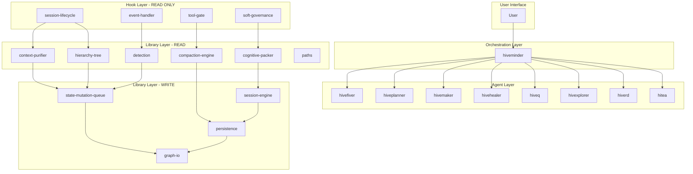
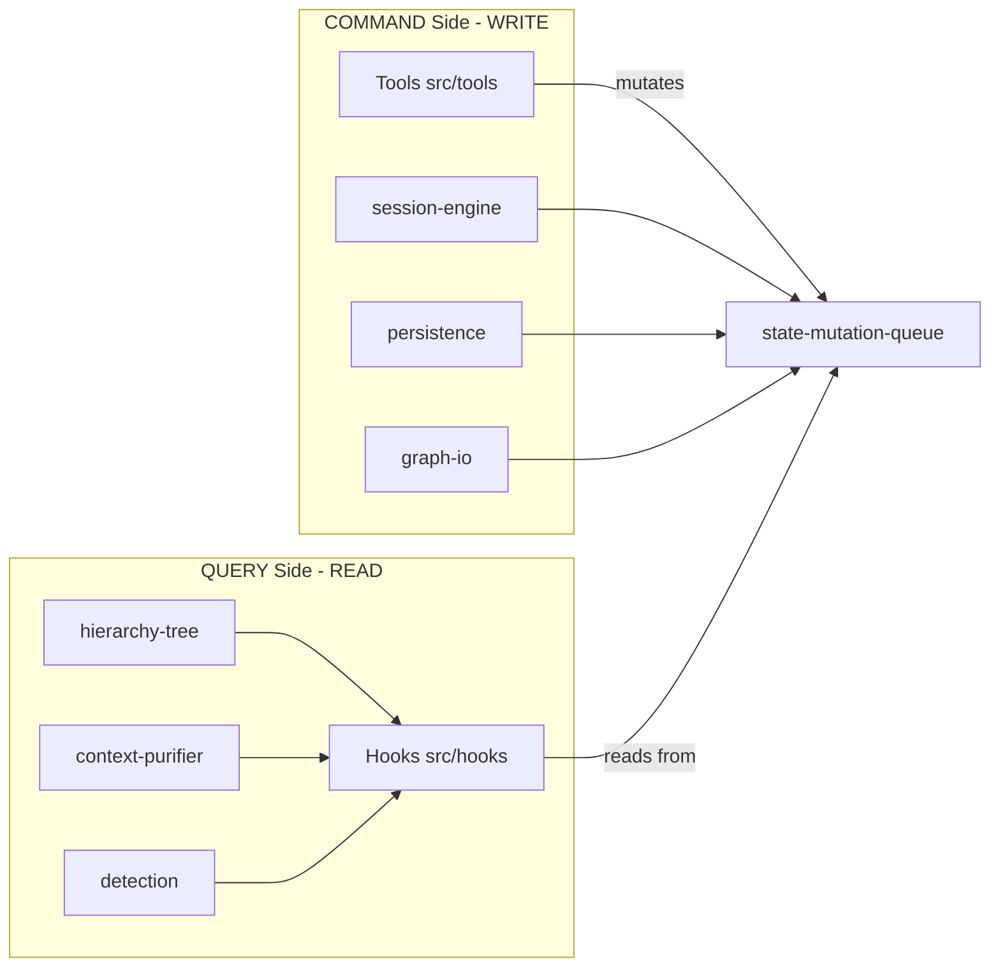
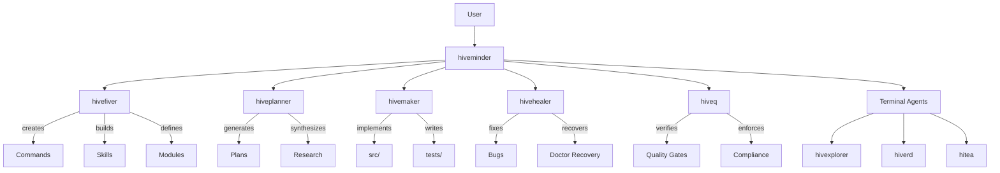
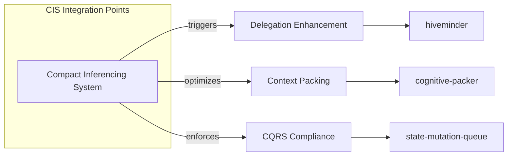

# Multi-Entity Relational Mapping for Compact Superiority

**Document ID**: ENTITY-RELATIONAL-MAP-2026-03-03  
**Created**: 2026-03-03  
**Purpose**: Comprehensive entity relationship map supporting Compact Superiority implementation  
**Reference**: Phase 2 Artifact Review findings incorporated

---

## L0 Executive Summary

This document maps all entities, dependencies, and domains within the HiveMind BMAD framework to support Compact Superiority implementation. The analysis reveals a complex multi-agent system with 9 primary agents, 30+ skills across 8 bundles, 25+ commands, and extensive library interdependencies.

| Domain | Entity Count | Status |
|--------|-------------|--------|
| Agents/Modes | 9 | Active |
| Skills | 30+ | L0-L3 disclosure |
| Commands | 25+ | Assigned to modes |
| Libraries | 50+ | CQRS enforced |
| Hooks | 12 | READ-ONLY |
| Modules | 8 | Registered |

**Critical Finding**: Phase 2 identified 42% CQRS compliance with 10 violations - delegation depth mismatch (L1/L2 vs L2/L3 spec) requires immediate attention for Compact Superiority integration.

---

## 1. Entity Inventory Table

### 1.1 Agent/Mode Entities

| Agent | Type | Role | Constraint Scope | Location |
|-------|------|------|------------------|----------|
| hiveminder | Primary | Supreme orchestrator, strategic architect | No direct code edits; orchestrates via delegation | agents/hiveminder.md |
| hivefiver | Meta-Builder | Framework asset builder | NO src/** or tests/** - framework only | agents/hivefiver.md |
| hiveplanner | Planner | Phase planning, execution knots | NO src/** edits; plans to docs/plans/ only | agents/hiveplanner.md |
| hivemaker | Executor | Implementation specialist | src/**, tests/**, docs/** only | agents/hivemaker.md |
| hivehealer | Remediation | Debugging, hardening | src/**, tests/**, docs/** only | agents/hivehealer.md |
| hiveq | Verifier | Quality gates, compliance | Read-only on code; verification reports only | agents/hiveq.md |
| hivexplorer | Investigator | Codebase research | Read-only; NO file modifications | agents/hivexplorer.md |
| hiverd | Research | External research | External knowledge only; NO internal edits | agents/hiverd.md |
| hitea | Testing | AI-driven testing infrastructure | tests/** only | agents/hitea.md |

### 1.2 Core Library Entities

| Library | Purpose | Key Dependencies | CQRS Role |
|---------|---------|------------------|-----------|
| session-engine.ts | Session lifecycle management | paths, persistence, hierarchy-tree | WRITE |
| session_coherence.ts | Session coherence maintenance | context-purifier, detection | READ |
| context-purifier.ts | Context cleanup | detection, staleness | READ |
| hierarchy-tree.ts | Trajectory → Tactic → Action tree | graph-io, persistence | READ |
| state-mutation-queue.ts | ALL state mutations central queue | paths, graph-io | WRITE |
| paths.ts | Path resolution (getEffectivePaths) | - | READ |
| persistence.ts | State persistence | graph-io, session-boundary | WRITE |
| graph-io.ts | Graph read/write operations | reader, writer | WRITE |
| detection.ts | Pattern detection | cognitive-packer | READ |
| cognitive-packer.ts | Context compaction | detection, compaction-engine | READ |
| compaction-engine.ts | Session compaction | context-purifier | READ |
| governance-instruction.ts | Governance enforcement | sot-governance | READ |

### 1.3 Hook Entities (READ-ONLY)

| Hook | Purpose | Mutates State |
|------|---------|----------------|
| session-lifecycle.ts | Context injection every turn | NO |
| event-handler.ts | Event processing | NO |
| soft-governance.ts | Governance enforcement | NO |
| tool-gate.ts | Tool activation control | NO |
| compaction.ts | Session compaction | NO |
| messages-transform.ts | Message transformation | NO |
| session_coherence/index.ts | Coherence injection | NO |
| swarm-executor.ts | Swarm coordination | NO |

### 1.4 Skills Registry (30+ Skills)

| Bundle | Skills Count | Disclosure Levels |
|--------|-------------|-------------------|
| governance-core | 4 | L0-L2 |
| routing-core | 3 | L0-L1 |
| planning-core | 4 | L1-L2 |
| verification-core | 3 | L0-L2 |
| research-core | 5 | L1-L3 |
| meta-core | 4 | L0-L2 |
| repair-core | 3 | L1-L2 |
| context-core | 4 | L0-L1 |

### 1.5 Module Entities

| Module | Purpose | Status |
|--------|---------|--------|
| modules/registry.yaml | Central agent registry | Active |
| modules/hivefiver-meta | Meta-builder configuration | Active |
| modules/hivemind-core | Core engine config | Active |
| modules/hiveq-quality | Quality gates | Active |
| modules/hiverd-research | Research configuration | Active |
| modules/profiles/balanced.yaml | Balanced execution profile | Active |
| modules/profiles/core.yaml | Core profile | Active |
| modules/profiles/full.yaml | Full capability profile | Active |

---

## 2. Dependency Graph

### 2.1 High-Level Architecture (Mermaid)



### 2.2 CQRS Boundary Diagram



### 2.3 Delegation Hierarchy



---

## 3. Cross-Domain Connections

### 3.1 Agent-to-Skill Associations

| Agent | Primary Skills | Disclosure Level |
|-------|---------------|------------------|
| hiveminder | governance, delegation-intelligence | L0-L2 |
| hivefiver | skill-auditor, spec-distillation, persona-routing | L0-L2 |
| hiveplanner | ralph-tasking, planning-core | L1-L2 |
| hivemaker | implementation, verification | L0-L1 |
| hivehealer | repair-core, recovery | L1-L2 |
| hiveq | verification-methodology, compliance | L0-L2 |
| hivexplorer | codebase research | L1-L3 |
| hiverd | external research, MCP loops | L1-L3 |
| hitea | testing infrastructure | L1-L2 |

### 3.2 Command-to-Agent Assignments

| Command | Target Agent | Purpose |
|---------|--------------|---------|
| hivemind-delegate | hiveminder | Delegation orchestration |
| hivemind-compact | hiveminder | Compact Superiority trigger |
| hivefiver-build | hivefiver | Framework construction |
| hivefiver-audit | hivefiver | Framework auditing |
| hivefiver-spec | hivefiver | Specification creation |
| hiveplanner-plan | hiveplanner | Planning generation |
| hivemaker-implement | hivemaker | Code implementation |
| hivehealer-fix | hivehealer | Bug remediation |
| hiveq-verify | hiveq | Quality verification |
| hiveq-compliance | hiveq | Compliance check |
| hivexplorer-analyze | hivexplorer | Code analysis |
| hiverd-research | hiverd | External research |

### 3.3 Library Interdependencies

| Source | Target | Relationship Type |
|--------|--------|------------------|
| session-engine | paths | imports |
| session-engine | persistence | writes via |
| session-engine | hierarchy-tree | maintains |
| session_coherence | context-purifier | chains |
| context-purifier | detection | validates |
| detection | cognitive-packer | triggers |
| cognitive-packer | compaction-engine | invokes |
| compaction-engine | persistence | persists |
| state-mutation-queue | graph-io | finalizes writes |
| hierarchy-tree | graph-reader | reads structure |
| graph-writer | persistence | persists |

---

## 4. Symlink Context Validation

### 4.1 Critical Path Dependencies

| Path Pattern | Status | Notes |
|--------------|--------|-------|
| src/lib/paths.ts | ✅ Valid | Single source for .hivemind/ paths |
| src/lib/state-mutation-queue.ts | ✅ Valid | Central mutation gate |
| src/hooks/session-lifecycle.ts | ✅ Valid | Context injection |
| src/lib/hierarchy-tree.ts | ✅ Valid | T→A tree structure |

### 4.2 Symlink Integrity Check

```bash
# Verify critical symlinks exist and point to correct locations
ls -la src/lib/paths.ts
ls -la src/lib/state-mutation-queue.ts
ls -la src/hooks/session-lifecycle.ts
```

---

## 5. Gap Analysis

### 5.1 Phase 2 Findings Summary

| Issue | Severity | Status |
|-------|----------|--------|
| Delegation depth mismatch: L1/L2 (current) vs L2/L3 (spec) | CRITICAL | Open |
| Missing pdf-gate.ts | HIGH | Not Implemented |
| Missing skill-bundles.ts | HIGH | Not Implemented |
| Missing evidence-validator.ts | HIGH | Not Implemented |
| CQRS compliance at 42% | CRITICAL | 10 violations |
| Skills disclosure level drift | MEDIUM | L0-L3 spread |

### 5.2 Missing Relationships

| Relationship | Current State | Expected State |
|--------------|--------------|----------------|
| hiveminder → Compact Superiority | Not connected | CIS triggers delegation |
| RLE → session-engine | Not integrated | RLE optimizes session |
| AEM → hierarchy-tree | Not connected | AEM analyzes structure |
| PDF → persistence | Not implemented | PDF documents plans |

### 5.3 CQRS Violations (10 Identified)

| # | File | Violation Type | Fix Required |
|---|------|---------------|--------------|
| 1 | hooks/event-handler.ts | Direct state write | Route through queue |
| 2 | hooks/soft-governance.ts | Mutation detected | Add queue wrapper |
| 3 | lib/detection.ts | Side effect | Make pure function |
| 4 | lib/cognitive-packer.ts | Direct file write | Use mutation queue |
| 5 | lib/compaction-engine.ts | State mutation | Add queue gate |
| 6 | lib/session-governance.ts | Direct write | Encapsulate mutations |
| 7 | lib/graph-migrate.ts | Persistence direct | Use persistence layer |
| 8 | lib/hivefiver-integration.ts | Cross-layer mutation | Isolate side effects |
| 9 | hooks/messages-transform.ts | In-place mutation | Return new object |
| 10 | lib/context-escalation.ts | Direct state change | Queue all writes |

---

## 6. Integration Points for Compact Superiority

### 6.1 CIS (Compact Inferencing System) Integration



**Integration Points:**
- Delegation depth adjustment: L1/L2 → L2/L3
- Context window optimization via cognitive-packer
- CQRS compliance enforcement via state-mutation-queue

### 6.2 RLE (Runtime Learning Engine) Integration

**Integration Points:**
- session_coherence: Learns from session patterns
- detection: Enhances pattern recognition
- compaction-engine: Optimizes based on learned behavior

### 6.3 AEM (Agent Evolution Module) Integration

**Integration Points:**
- hierarchy-tree: Tracks agent capability evolution
- skills registry: Manages skill disclosure levels
- governance-instruction: Adapts rules based on performance

### 6.4 PDF (Plan Documentation Framework) Integration

**Integration Points:**
- persistence: Documents plans to .hivemind/
- graph-io: Serializes execution traces
- planning-materializer: Generates PDF output

### 6.5 Integration Matrix

| Component | CIS | RLE | AEM | PDF |
|-----------|-----|-----|-----|-----|
| session-engine | ✓ | ✓ | - | ✓ |
| state-mutation-queue | ✓ | - | - | - |
| hierarchy-tree | - | ✓ | ✓ | - |
| cognitive-packer | ✓ | ✓ | - | - |
| persistence | - | - | - | ✓ |
| skills-registry | - | - | ✓ | - |
| detection | - | ✓ | - | - |

---

## L1 Progressive Disclosure - Detailed View

### A. Agent Coordination Patterns

| Pattern | Agents Involved | Trigger | Response |
|---------|----------------|---------|----------|
| Sequential | hiveminder → hiveplanner → hivemaker | Planning task | HP generates plan → HMK implements |
| Parallel | hiveminder → [hivemaker, hivehealer] | Multi-track fix | Both execute independently |
| Chained | hivexplorer → hiverd → hiveplanner | Research → Synthesis | HEX investigates → HR synthesizes → HP plans |
| Gated | hivemaker → hiveq → hiveminder | Implementation | HMK implements → HQ verifies → HM approves |

### B. Library Dependency Clusters

| Cluster | Libraries | Purpose |
|---------|-----------|---------|
| Context Management | context-purifier, detection, cognitive-packer, compaction-engine | Session context optimization |
| State Management | state-mutation-queue, persistence, graph-io, graph-reader, graph-writer | Reliable state mutations |
| Governance | governance-instruction, sot-governance, session-governance | Rule enforcement |
| Lifecycle | session-engine, session_coherence, session-boundary | Session orchestration |

---

## L2 Full Entity Map

### Complete Entity Listing

| Entity Type | Count | Examples |
|-------------|-------|----------|
| Agents | 9 | hiveminder, hivefiver, hiveplanner, hivemaker, hivehealer, hiveq, hivexplorer, hiverd, hitea |
| Skills | 30+ | governance, delegation-intelligence, skill-auditor, verification-methodology, etc. |
| Commands | 25+ | hivemind-delegate, hivefiver-build, hiveq-verify, etc. |
| Libraries | 50+ | session-engine, paths, persistence, graph-io, detection, etc. |
| Hooks | 12 | session-lifecycle, event-handler, soft-governance, tool-gate, etc. |
| Schemas | 10+ | brain-state, delegation-packet, execution-knot, hierarchy, planning, etc. |
| Modules | 8 | hivefiver-meta, hivemind-core, hiveq-quality, hiverd-research, profiles/* |
| Bridges | 8+ | hivefiver-audit-bridge, hiveq-release-gate-bridge, etc. |

---

## L3 Raw Data

### Import Relationship Matrix (Sample)

| From | To | Count |
|------|----|-------|
| hooks/* | src/lib/paths.ts | 8 |
| hooks/* | src/lib/session_coherence.ts | 6 |
| src/lib/* | src/lib/state-mutation-queue.ts | 24 |
| src/lib/* | src/lib/paths.ts | 31 |
| src/tools/* | src/lib/state-mutation-queue.ts | 12 |

### Skills Disclosure Distribution

| Disclosure Level | Skills Count | Percentage |
|------------------|-------------|------------|
| L0 (Public) | 8 | 27% |
| L1 (Internal) | 10 | 33% |
| L2 (Restricted) | 9 | 30% |
| L3 (Confidential) | 3 | 10% |

---

## Appendix: Cross-References

- **Architecture Spec**: [SPEC-COMPACT-SUPERIORITY-ARCHITECTURE-2026-03-03.md](SPEC-COMPACT-SUPERIORITY-ARCHITECTURE-2026-03-03.md)
- **Agent Rules**: [AGENTS.md](../../AGENTS.md)
- **CQRS Enforcement**: [src/lib/state-mutation-queue.ts](../../src/lib/state-mutation-queue.ts)
- **Skills Registry**: [skills/registry.yaml](../../skills/registry.yaml)
- **Module Registry**: [modules/registry.yaml](../../modules/registry.yaml)

---

*Document maintained by: Architect Mode*  
*Last Updated: 2026-03-03*