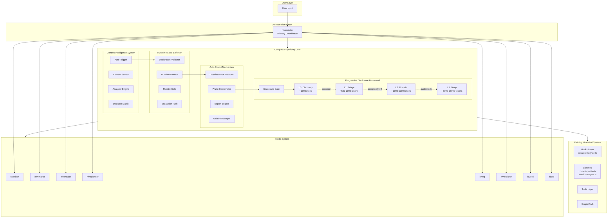
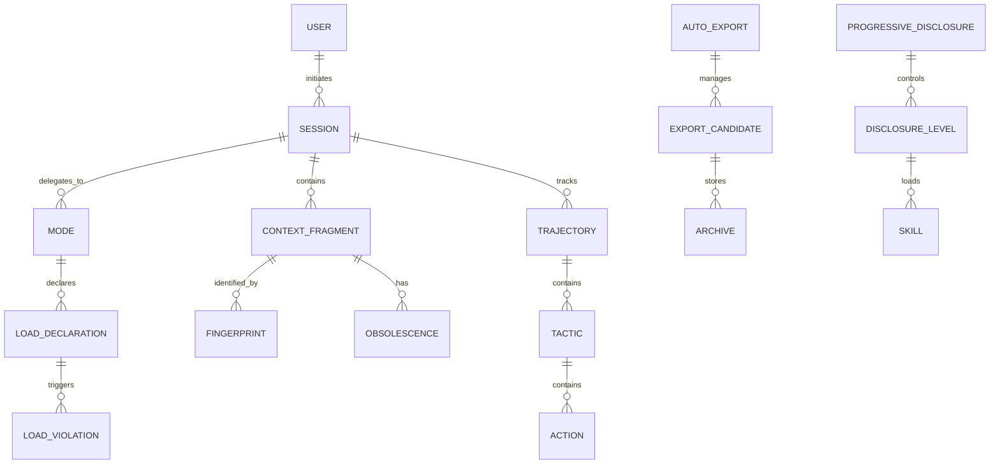
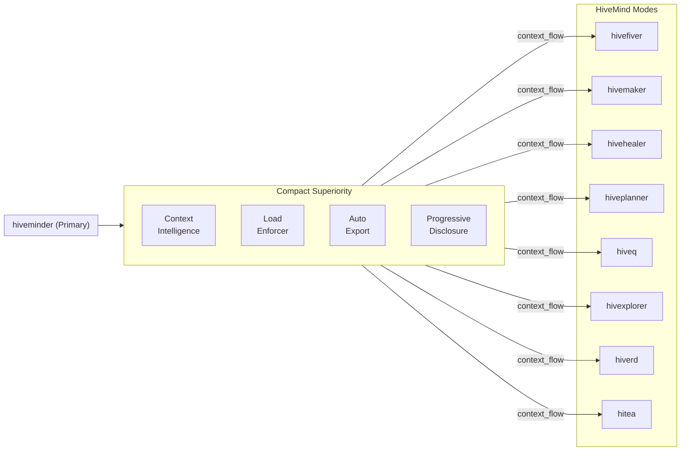

# Compact Superiority Architecture Framework

> **Document ID:** CSA-2026-03-03
> **Status:** Architecture Design
> **Purpose:** Design meta-framework architecture that replaces innate OpenCode mechanisms with non-intrusive alternatives
> **Date:** 2026-03-03

---

## Executive Summary

This architecture document defines a **Compact Superiority** system that synthesizes concepts from external codebases (opencode-dynamic-context-pruning, opencode-shell-strategy, opencode-background-agents, subtask2) while maintaining compatibility with the existing HiveMind plugin framework.

### Design Principles

1. **Non-Intrusive Replacement**: Replace OpenCode innate mechanisms with controlled alternatives
2. **Context Purification**: Prune/purge to purify context while maintaining integrity
3. **Granularity Control**: Adapt subtask management for variable workloads
4. **Survival Architecture**: Background run concepts for investigation survival

### Terminology Alignment

| OpenCode Term | Kilocode Equivalent | Notes |
|---------------|---------------------|-------|
| agents/subagents | modes | HiveFiver uses "modes" terminology |
| delegation | handoff | Controlled document-based handoff |
| context window | budget | Token/character limits |

---

## Part 1: Component Architecture

### 1.1 System Component Hierarchy



### 1.2 Component Description

#### Context Intelligence System (CIS)

**Purpose**: Replace automatic session creation with intelligent context-aware triggering

**Components**:
- **Context Sensor**: Monitors incoming user input, mode transitions, and context load
- **Analyzer Engine**: Processes signals to determine session state needs
- **Decision Matrix**: Evaluates conditions for new-session auto-trigger
- **Auto-Trigger**: Executes controlled session transitions

**Integration Point**: Extends [`session-lifecycle.ts`](src/hooks/session-lifecycle.ts) with intelligent triggers

```typescript
interface ContextSignal {
  type: 'user_input' | 'mode_transition' | 'context_threshold' | 'drift_detected'
  payload: unknown
  timestamp: number
}

interface SessionTriggerDecision {
  action: 'create_session' | 'resume_session' | 'split_session' | 'compact_session'
  confidence: number
  rationale: string
}
```

#### Run-time Load Enforcer (RLE)

**Purpose**: Declare and validate resource constraints at runtime

**Components**:
- **Declaration Validator**: Validates load declarations against configured limits
- **Runtime Monitor**: Tracks actual resource consumption
- **Throttle Gate**: Controls context injection rate
- **Escalation Path**: Routes overflow to background processing

**Integration Point**: Extends budget management in [`session-lifecycle.ts`](src/hooks/session-lifecycle.ts)

```typescript
interface LoadDeclaration {
  maxTokens: number
  maxContextFragments: number
  priorityLevel: 'critical' | 'high' | 'normal' | 'low'
  ttl?: number // Time-to-live for temporary contexts
}

interface LoadViolation {
  declaration: LoadDeclaration
  actual: LoadSnapshot
  severity: 'warning' | 'critical' | 'blocking'
  action: 'throttle' | 'compact' | 'export' | 'halt'
}
```

#### Auto-Export Mechanism (AEM)

**Purpose**: Reduce pruning obsoletes through intelligent export-before-prune

**Components**:
- **Obsolescence Detector**: Identifies context fragments approaching staleness
- **Export Engine**: Converts stale contexts to persistent storage
- **Prune Coordinator**: Coordinates export-before-delete operations
- **Archive Manager**: Manages long-term context retention

**Integration Point**: Extends [`context-purifier.ts`](src/lib/context-purifier.ts) with export capabilities

```typescript
interface ObsolescenceMetrics {
  fragmentId: string
  stalenessScore: number // 0-1
  lastAccessTime: number
  relevanceScore: number
  exportPriority: 'immediate' | 'deferred' | 'skip'
}

interface ExportCandidate {
  fragment: ContextFragment
  targetArchive: string
  retentionPolicy: 'ephemeral' | 'session' | 'project' | 'permanent'
}
```

#### Progressive Disclosure Framework (PDF)

**Purpose**: Level-gated information loading aligned with SPEC-META-BUILDER patterns

**Disclosure Levels**:

| Level | Token Cost | Trigger | Content |
|-------|------------|---------|---------|
| L0 | ~100 | Always visible | Name + description only |
| L1 | ~500-2000 | On explicit need | Full body, basic templates |
| L2 | ~1000-5000 | Complexity >2 | Domain-specific references |
| L3 | ~5000-15000 | Audit mode | Complete reference |

**Integration Point**: Extends skill loading in [`SPEC-META-BUILDER-MODULE-2026-03-01.md`](docs/SPEC-META-BUILDER-MODULE-2026-03-01.md)

---

## Part 2: Entity Relationship Map

### 2.1 Core Entities



### 2.2 Entity Definitions

| Entity | Type | Description | Key Attributes |
|--------|------|-------------|-----------------|
| USER | Root | Human operator | id, expertise_level |
| SESSION | Core | Active working context | id, mode, state, turn_count |
| MODE | Core | Executing capability (hivefiver, hivemaker, etc.) | name, role, permissions |
| CONTEXT_FRAGMENT | Core | Individual context piece | id, content, fingerprint, staleness |
| TRAJECTORY | Hierarchy | Top-level goal | id, content, status, stamp |
| TACTIC | Hierarchy | Mid-level approach | id, content, parent_trajectory |
| ACTION | Hierarchy | Bottom-level task | id, content, parent_tactic |
| LOAD_DECLARATION | Constraint | Resource limits | maxTokens, maxFragments, priority |
| OBSOLESCENCE | State | Aging metrics | stalenessScore, lastAccess, relevance |
| EXPORT_CANDIDATE | Transient | Items for archiving | fragment, retentionPolicy |
| DISCLOSURE_LEVEL | State | PDF gate state | level, tokenCost, loaded |

---

## Part 3: Integration Points

### 3.1 Existing System Integration

| Integration Point | File | Extension Mechanism |
|-----------------|------|-------------------|
| Session Lifecycle | [`session-lifecycle.ts`](src/hooks/session-lifecycle.ts) | Prepend CIS decision to existing hook flow |
| Context Purification | [`context-purifier.ts`](src/lib/context-purifier.ts) | Extend with AEM export hooks |
| Session Engine | [`session-engine.ts`](src/lib/session-engine.ts) | Add RLE validation to session operations |
| Hierarchy Tree | [`hierarchy-tree.ts`](src/lib/hierarchy-tree.ts) | Integrate PDF gating in tree queries |
| State Mutation Queue | [`state-mutation-queue.ts`](src/lib/state-mutation-queue.ts) | Add RLE validation before mutations |

### 3.2 Mode System Integration

The Compact Superiority framework integrates with the existing delegation hierarchy:



### 3.3 Symlink Context Structure

For progressive disclosure, symlink contexts establish validation paths:

```
symlink_contexts/
├── cis_sensor/
│   ├── input_classification.yaml    # Signal types
│   ├── decision_matrix.yaml         # Trigger rules
│   └── trigger_actions.yaml         # Execution specs
├── rle_declare/
│   ├── load_limits.yaml             # Threshold config
│   ├── violation_actions.yaml       # Response matrix
│   └── throttle_curves.yaml         # Rate limiting
├── aem_export/
│   ├── obsolescence_rules.yaml      # Detection patterns
│   ├── export_templates.yaml        # Format specs
│   └── retention_policies.yaml     # Storage rules
└── pdf_disclosure/
    ├── level_configs.yaml           # L0-L3 definitions
    ├── disclosure_triggers.yaml     # Gate conditions
    └── skill_manifests.yaml         # Skill loading rules
```

---

## Part 4: Investigation Framework

### 4.1 Key Artifacts to Analyze

| Artifact | Location | Purpose | Analysis Focus |
|----------|----------|---------|----------------|
| Session State | `.hivemind/state/brain.json` | Current context | Load patterns, staleness |
| Hierarchy Tree | `.hivemind/graph/trajectory.json` | Goal structure | Gap detection, drift |
| Context Fingerprints | Runtime memory | Fragment identity | Deduplication efficiency |
| Mode Permissions | `agents/*.md` | Delegation rules | Constraint violations |
| Skill Registry | `skills/*.md` | Capability catalog | Load frequency, dependencies |

### 4.2 Validation Checkpoints

| Checkpoint | Trigger | Validation Criteria | Escalation Path |
|------------|---------|---------------------|-----------------|
| CIS_SANITY | Every turn | Signal processing latency <50ms | Log warning, continue |
| RLE_BUDGET | Pre-context injection | Load < declared limits | Throttle or split |
| AEM_STALENESS | On context access | Staleness score <0.7 | Export before prune |
| PDF_GATE | On skill load | Token budget sufficient | Load L0 only |
| MODE_HANDOVER | On delegation | Context完整性 | Queue mutation |

### 4.3 Investigation Survival Patterns

For background run survival during investigation:

```typescript
interface InvestigationSurvival {
  checkpointInterval: number      // ms between state snapshots
  rollbackTarget: string           // Last known good state
  backgroundExecution: boolean     // Continue if parent dies
  signalHandlers: {
    SIGTERM: 'checkpoint_and_exit'
    SIGUSR1: 'pause_and_snapshot'
    SIGUSR2: 'resume_from_snapshot'
  }
}
```

---

## Part 5: Implementation Roadmap

### Phase 1: Foundation (Week 1-2)

**Objective**: Establish core infrastructure without disrupting existing functionality

| Task | Dependencies | Deliverable |
|------|-------------|--------------|
| P1.1 Create CIS module skeleton | None | `src/lib/compact-superiority/cis.ts` |
| P1.2 Define ContextSignal types | P1.1 | Schema in `src/schemas/compact-superiority.ts` |
| P1.3 Integrate CIS sensor into session-lifecycle | P1.1, session-lifecycle.ts | Conditional context injection |
| P1.4 Write unit tests for CIS | P1.1, P1.2 | `tests/unit/compact-superiority/` |

**Exit Criteria**: CIS fires correctly without breaking existing session lifecycle

### Phase 2: Load Enforcement (Week 3-4)

**Objective**: Implement runtime constraint management

| Task | Dependencies | Deliverable |
|------|-------------|--------------|
| P2.1 Create RLE module | Phase 1 complete | `src/lib/compact-superiority/rle.ts` |
| P2.2 Define LoadDeclaration schema | P2.1 | Extension to `src/schemas/` |
| P2.3 Implement throttle curves | P2.1 | Rate limiting algorithm |
| P2.4 Add RLE validation to state-mutation-queue | P2.2, P2.3 | Pre-mutation validation |

**Exit Criteria**: RLE correctly enforces declared limits without blocking valid operations

### Phase 3: Auto-Export (Week 5-6)

**Objective**: Reduce context loss through intelligent export-before-prune

| Task | Dependencies | Deliverable |
|------|-------------|--------------|
| P3.1 Extend context-purifier with AEM | Phase 2 complete | Export hooks in purifier |
| P3.2 Implement obsolescence detector | P3.1 | Scoring algorithm |
| P3.3 Create archive manager | P3.2 | `.hivemind/archive/` structure |
| P3.4 Integrate with session close | P3.3, session-engine.ts | Auto-export on close |

**Exit Criteria**: Stale contexts exported before pruning, retrievable on resume

### Phase 4: Progressive Disclosure (Week 7-8)

**Objective**: Implement level-gated information loading

| Task | Dependencies | Deliverable |
|------|-------------|--------------|
| P4.1 Define PDF disclosure levels | Phase 3 complete | L0-L3 configuration |
| P4.2 Create disclosure gate component | P4.1 | `src/lib/compact-superiority/pdf-gate.ts` |
| P4.3 Integrate with skill loading | P4.2, SPEC-META-BUILDER | Conditional skill load |
| P4.4 Add token budget tracking | P4.3 | Real-time budget monitor |

**Exit Criteria**: Skills load at appropriate disclosure levels based on context budget

### Phase 5: Integration & Hardening (Week 9-10)

**Objective**: Full system integration and edge case handling

| Task | Dependencies | Deliverable |
|------|-------------|--------------|
| P5.1 End-to-end integration test | All phases | Test suite |
| P5.2 Edge case handling | P5.1 | Error recovery paths |
| P5.3 Performance optimization | P5.1 | Latency < 100ms |
| P5.4 Documentation update | P5.2 | API docs, integration guide |

**Exit Criteria**: Full system operational with <1% failure rate

---

## Part 6: Risk Mitigation

| Risk | Severity | Mitigation Strategy |
|------|----------|---------------------|
| CIS false positives | High | Confidence threshold (≥0.8), manual override |
| RLE over-throttling | Medium | Graceful degradation, user notification |
| AEM storage bloat | Medium | Retention policies, automatic cleanup |
| PDF context loss | High | Mandatory L0 always loaded |
| Mode handoff failure | Critical | State mutation queue with rollback |

---

## Part 7: Success Metrics

| Metric | Target | Measurement |
|--------|--------|--------------|
| Context purification efficiency | ≥95% | Deduplicated / total fragments |
| Load enforcement accuracy | ≥99% | Valid declarations / total declarations |
| Export-before-prune coverage | ≥90% | Exported / stale fragments |
| Disclosure level appropriateness | ≥85% | Correct level loads / total loads |
| System latency impact | <50ms | Average hook execution time |

---

## Appendix A: Configuration Schema

```yaml
compact_superiority:
  context_intelligence:
    enabled: true
    auto_trigger_threshold: 0.7
    signal_processing_timeout_ms: 50
    
  load_enforcer:
    enabled: true
    default_limits:
      max_tokens: 12000
      max_fragments: 50
      priority: normal
    throttle_curves:
      warning: 0.6
      critical: 0.8
      blocking: 0.95
      
  auto_export:
    enabled: true
    staleness_threshold: 0.7
    retention_policies:
      ephemeral: 1h
      session: 7d
      project: 30d
      permanent: never
      
  progressive_disclosure:
    enabled: true
    levels:
      l0:
        token_budget: 100
        always_load: true
      l1:
        token_budget: 2000
        load_on_invoke: true
      l2:
        token_budget: 5000
        complexity_threshold: 2
      l3:
        token_budget: 15000
        audit_mode_only: true
```

---

## Appendix B: Reference Implementation Files

| File | Purpose |
|------|---------|
| [`src/lib/context-purifier.ts`](src/lib/context-purifier.ts) | Base purification (extend for AEM) |
| [`src/lib/session-engine.ts`](src/lib/session-engine.ts) | Session lifecycle (extend for CIS) |
| [`src/hooks/session-lifecycle.ts`](src/hooks/session-lifecycle.ts) | Context injection (integration point) |
| [`src/lib/hierarchy-tree.ts`](src/lib/hierarchy-tree.ts) | Trajectory hierarchy (extend for PDF) |
| [`src/lib/state-mutation-queue.ts`](src/lib/state-mutation-queue.ts) | Mutation control (extend for RLE) |
| [`docs/SPEC-META-BUILDER-MODULE-2026-03-01.md`](docs/SPEC-META-BUILDER-MODULE-2026-03-01.md) | Progressive disclosure patterns |
| [`AGENTS.md`](AGENTS.md) | Mode registry and delegation hierarchy |

---

*Document Created: 2026-03-03*
*Architecture Version: 1.0.0*
*Next Review: After Phase 1 completion*