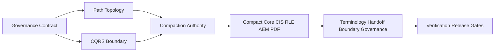
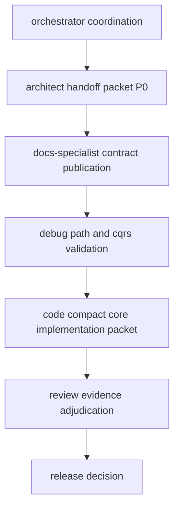

# Strategic Landscape Phasing — Compact Superiority Rollout

> **Document ID:** STRATEGIC-LANDSCAPE-PHASING-2026-03-03  
> **Date:** 2026-03-03  
> **Scope:** Front-facing coordination and downstream execution planning  
> **Inputs:** [SPEC-COMPACT-SUPERIORITY-ARCHITECTURE-2026-03-03.md](docs/plans/SPEC-COMPACT-SUPERIORITY-ARCHITECTURE-2026-03-03.md:1), [ENTITY-RELATIONAL-MAP-2026-03-03.md](docs/plans/ENTITY-RELATIONAL-MAP-2026-03-03.md:1), [EXPLORE1-ARCH-STRUCTURE-2026-03-03.md](docs/plans/EXPLORE1-ARCH-STRUCTURE-2026-03-03.md:1), [EXPLORE2-DOCS-COMMITS-DIRECTION-2026-03-03.md](docs/plans/EXPLORE2-DOCS-COMMITS-DIRECTION-2026-03-03.md:1), [CONTEXT-PURIFICATION-VALIDATION-2026-03-03.md](docs/plans/CONTEXT-PURIFICATION-VALIDATION-2026-03-03.md:1)

**Terminology policy note:**
- **OpenCode terminology is canonical for project artifacts.**
- **Kilocode mode terminology is orchestration-only for this development environment.**

---

## 1. Landscape Overview

### 1.1 Coordinator-facing domains and boundaries

| Domain ID | Domain | Boundary | Primary Mode Ownership | Evidence Anchor |
|---|---|---|---|---|
| D1 | Governance Contract Canonicalization | Defines authoritative contract stack and contradiction resolution | `architect` + `docs-specialist` | [EXPLORE2](docs/plans/EXPLORE2-DOCS-COMMITS-DIRECTION-2026-03-03.md:131), [CONTEXT-PURIFICATION](docs/plans/CONTEXT-PURIFICATION-VALIDATION-2026-03-03.md:112) |
| D2 | Path and State Topology Integrity | Enforces path resolver policy and removes stale path usage | `architect` + `debug` | [CONTEXT-PURIFICATION](docs/plans/CONTEXT-PURIFICATION-VALIDATION-2026-03-03.md:84), [getEffectivePaths()](src/lib/paths.ts:1) |
| D3 | CQRS Boundary Integrity | Converts convention-based flush discipline into gate-verified write boundary | `debug` + `review` | [EXPLORE1](docs/plans/EXPLORE1-ARCH-STRUCTURE-2026-03-03.md:100), [flushMutations()](src/lib/state-mutation-queue.ts:400) |
| D4 | Compaction Authority Unification | Selects one canonical compaction authority and removes semantic split | `architect` + `debug` | [EXPLORE1](docs/plans/EXPLORE1-ARCH-STRUCTURE-2026-03-03.md:106), [executeCompaction()](src/lib/compaction-engine.ts:252) |
| D5 | Compact Core Rollout | Stages CIS, RLE, AEM, PDF in dependency order | `code` + `debug` | [SPEC](docs/plans/SPEC-COMPACT-SUPERIORITY-ARCHITECTURE-2026-03-03.md:375), [SPEC](docs/plans/SPEC-COMPACT-SUPERIORITY-ARCHITECTURE-2026-03-03.md:388), [SPEC](docs/plans/SPEC-COMPACT-SUPERIORITY-ARCHITECTURE-2026-03-03.md:401), [SPEC](docs/plans/SPEC-COMPACT-SUPERIORITY-ARCHITECTURE-2026-03-03.md:414) |
| D6 | Terminology and Handoff Boundary Governance | Preserves OpenCode-canonical artifact language while constraining mode aliases to orchestration-only packet flow metadata | `architect` + `ask` | [SPEC](docs/plans/SPEC-COMPACT-SUPERIORITY-ARCHITECTURE-2026-03-03.md:23), [EXPLORE2](docs/plans/EXPLORE2-DOCS-COMMITS-DIRECTION-2026-03-03.md:156) |
| D7 | Verification and Release Gates | Governs pass-fail evidence before each phase transition | `review` + `code-reviewer` | [EXPLORE1](docs/plans/EXPLORE1-ARCH-STRUCTURE-2026-03-03.md:200), [CONTEXT-PURIFICATION](docs/plans/CONTEXT-PURIFICATION-VALIDATION-2026-03-03.md:137) |

### 1.2 Cross-domain dependency map

Dependency rationale:
- D1 must precede execution because the highest rollout risk is governance-contract drift, not new architecture invention ([EXPLORE2](docs/plans/EXPLORE2-DOCS-COMMITS-DIRECTION-2026-03-03.md:12)).
- D2 and D3 must stabilize before D4 and D5 because path drift and CQRS drift are P0-P1 blockers for deterministic behavior ([CONTEXT-PURIFICATION](docs/plans/CONTEXT-PURIFICATION-VALIDATION-2026-03-03.md:126), [CONTEXT-PURIFICATION](docs/plans/CONTEXT-PURIFICATION-VALIDATION-2026-03-03.md:131)).

---

## 2. Phase Architecture

**Final phase count: 6**

### Phase 0 — Contract Lock and Canonical Vocabulary

- **Critical Phases:** P0, P1 are blocked until this phase closes.
- **What’s Next:** Publish one contract matrix for main-session, sub-session, and continuity recovery behavior.
- **Ongoing:** OpenCode-canonical terminology enforcement, with mode aliases restricted to orchestration metadata.
- **Undone:** Universal strict confirmation contradiction and dual governance semantic ambiguity remain open.

### Phase 1 — Path and State Governance Hardening

- **Critical Phases:** Required for P2 and P3 to avoid stale state targeting.
- **What’s Next:** Enforce path linting on active governance and lifecycle documents.
- **Ongoing:** Resolver-first path policy using [getEffectivePaths()](src/lib/paths.ts:1).
- **Undone:** Remaining stale `.hivemind/hierarchy.json` references in active surfaces.

### Phase 2 — CQRS and Compaction Authority Stabilization

- **Critical Phases:** Required for safe execution of Compact Core runtime insertion.
- **What’s Next:** Mandate pre-write queue flush at boundary and choose single compaction authority.
- **Ongoing:** Queue-centric mutation model and hook read-only posture.
- **Undone:** Convention-based flush gaps and split compaction authority semantics.

### Phase 3 — Compact Core Foundation

- **Critical Phases:** Foundation for phased CIS and RLE rollout.
- **What’s Next:** Deliver CIS and RLE in runtime-compatible sequence.
- **Ongoing:** Integration planning against session lifecycle and mutation queue boundaries.
- **Undone:** CIS and RLE are not fully operationalized across all mode flows.

### Phase 4 — Compact Core Expansion

- **Critical Phases:** Requires Phase 3 PASS; gates Phase 5 readiness.
- **What’s Next:** Add AEM export-before-prune and PDF progressive disclosure controls.
- **Ongoing:** Staleness-aware context lifecycle and budget-aware disclosure policy.
- **Undone:** Full archive/retention and disclosure gate verification across all handoff lanes.

### Phase 5 — Integration Gate and Release Adjudication

- **Critical Phases:** Final release gate.
- **What’s Next:** Run integrated pass-fail adjudication across governance, pathing, CQRS, compaction, and disclosure.
- **Ongoing:** Evidence trace collection and blocker closure verification.
- **Undone:** Rollout cannot close while any P0 blocker remains unresolved.

### Ordered phase dependency chain

---

## 3. Downstream Activity Graph

### 3.1 Domain-to-domain handoff paths

### 3.2 Decision gates and required evidence

| Gate | Decision | Required Evidence | Fail Direction |
|---|---|---|---|
| G0 Contract Gate | Is canonical governance contract singular and terminology-boundary compliant | Conflict ledger resolution proof for confirmation contract and governance field semantics from [EXPLORE2](docs/plans/EXPLORE2-DOCS-COMMITS-DIRECTION-2026-03-03.md:117) and [CONTEXT-PURIFICATION](docs/plans/CONTEXT-PURIFICATION-VALIDATION-2026-03-03.md:58) | Hold at Phase 0 and block downstream packets |
| G1 Path Gate | Are active paths resolver-governed and stale path references removed | Path integrity table closure using [CONTEXT-PURIFICATION](docs/plans/CONTEXT-PURIFICATION-VALIDATION-2026-03-03.md:84) plus resolver policy proof via [getEffectivePaths()](src/lib/paths.ts:1) | Roll back to Phase 1 remediation lane |
| G2 CQRS Gate | Are write boundaries gate-enforced instead of convention-enforced | Flush boundary evidence mapped to [flushMutations()](src/lib/state-mutation-queue.ts:400) and Phase 5 checklist gates from [EXPLORE1](docs/plans/EXPLORE1-ARCH-STRUCTURE-2026-03-03.md:200) | Stop Phase 2 exit; open debug corrective packet |
| G3 Compaction Gate | Is compaction authority singular and consistent | Canonical authority decision referencing [executeCompaction()](src/lib/compaction-engine.ts:252) and hook path evidence from [EXPLORE1](docs/plans/EXPLORE1-ARCH-STRUCTURE-2026-03-03.md:225) | Re-enter Phase 2 authority arbitration |
| G4 Core Rollout Gate | Are CIS/RLE/AEM/PDF phase outputs complete in order | Phase outputs and criteria aligned with [SPEC](docs/plans/SPEC-COMPACT-SUPERIORITY-ARCHITECTURE-2026-03-03.md:375) through [SPEC](docs/plans/SPEC-COMPACT-SUPERIORITY-ARCHITECTURE-2026-03-03.md:438) | Freeze progression; return to missing component phase |
| G5 Release Gate | Is integrated rollout P0-clear and evidence-complete | Context integrity verdict upgrade from partial to pass relative to [CONTEXT-PURIFICATION](docs/plans/CONTEXT-PURIFICATION-VALIDATION-2026-03-03.md:137) and closed blocker map | Hold release; trigger rollback protocol |

---

## 4. Three Compact Downstream Processes

### Process Track 1 — Contract Convergence Track

- **Objective:** Converge governance policy into one authoritative matrix with OpenCode-canonical language and explicit orchestration-alias boundaries.
- **Entry Criteria:** Phase 0 started with unresolved CL-01, CL-05, CL-06, CL-07 conflicts ([CONTEXT-PURIFICATION](docs/plans/CONTEXT-PURIFICATION-VALIDATION-2026-03-03.md:60)).
- **Artifacts Produced:**
  - Canonical contract matrix
  - Terminology normalization ledger
  - Conflict closure register
- **Stop Criteria:** G0 PASS and no P0 confirmation contradiction remains.

### Process Track 2 — Runtime Integrity Track

- **Objective:** Stabilize pathing, CQRS boundary, and compaction authority before core rollout.
- **Entry Criteria:** Contract Convergence Track complete and Path Gate readiness declared.
- **Artifacts Produced:**
  - Path lint closure report
  - CQRS flush boundary evidence
  - Compaction authority decision record
- **Stop Criteria:** G1, G2, and G3 all PASS.

### Process Track 3 — Compact Core Release Track

- **Objective:** Roll out CIS, RLE, AEM, PDF with evidence-gated integration and release adjudication.
- **Entry Criteria:** Runtime Integrity Track complete with no open P0 runtime blockers.
- **Artifacts Produced:**
  - Phase 3 and Phase 4 rollout packet set
  - Integrated validation packet
  - Release adjudication memo
- **Stop Criteria:** G4 and G5 PASS and rollout status upgraded to release-ready.

---

## 5. Risk and Control Layer

### 5.1 Blockers mapped to phases

| Priority | Strategic Blocker | Mapped Phase | Control Guardrail | Rollback Trigger |
|---|---|---|---|---|
| P0 | Main-session confirmation contradiction vs delegated deterministic execution | Phase 0 | Single canonical contract matrix; no contradictory active policy text | Any gate packet that reintroduces contradictory confirmation rules |
| P0 | Canonical path drift and stale hierarchy path references | Phase 1 | Resolver-only path rule through [getEffectivePaths()](src/lib/paths.ts:1) with stale-path lint | Detection of stale `.hivemind/hierarchy.json` in active normative docs |
| P0 | Compaction authority split between engine and hook pathways | Phase 2 | Single authority declaration and mandatory route conformance | Runtime evidence shows mixed authority path usage in same release window |
| P1 | Dual governance semantics `governance_mode` vs `governance_status` | Phase 0 | Canonical field + migration contract + alias deprecation | Any governance decision uses both semantics without explicit mapping |
| P1 | Source-of-truth fragmentation across governance surfaces | Phase 0 to Phase 1 | Ordered SSoT stack and drift-check gate cadence | Drift check fails against SSoT stack |
| P1 | CQRS enforcement by convention | Phase 2 | Pre-write flush as hard boundary invariant | Mutation applied without pre-write queue reconciliation |
| P2 | Terminology boundary drift in active docs | Phase 0 and Phase 5 | OpenCode-canonical glossary lint with explicit orchestration-alias boundary checks | Unlabeled mode aliases appear in newly approved normative artifacts |

### 5.2 Guardrail bundle

1. **No phase exit without gate evidence:** Every phase requires gate-linked artifacts before promotion.
2. **No unresolved P0 carry-forward:** Any open P0 immediately blocks transition.
3. **Boundary-labeled coordination only:** Project artifacts use OpenCode-canonical terms; operational handoffs may use `architect`, `code`, `debug`, `review`, `ask`, `docs-specialist` mode labels in orchestration metadata.
4. **Path and mutation invariants are fail-close:** resolver/path drift and queue boundary drift force rollback.
5. **Release requires integrated adjudication:** Partial context integrity verdict is insufficient for closure ([CONTEXT-PURIFICATION](docs/plans/CONTEXT-PURIFICATION-VALIDATION-2026-03-03.md:139)).

---

## Strategic closure statement

This phasing package sets the Compact Superiority rollout on a governance-first, evidence-gated sequence where contract convergence and runtime integrity are prerequisites to core component rollout. The plan intentionally front-loads P0 blocker closure to avoid non-deterministic downstream execution.
