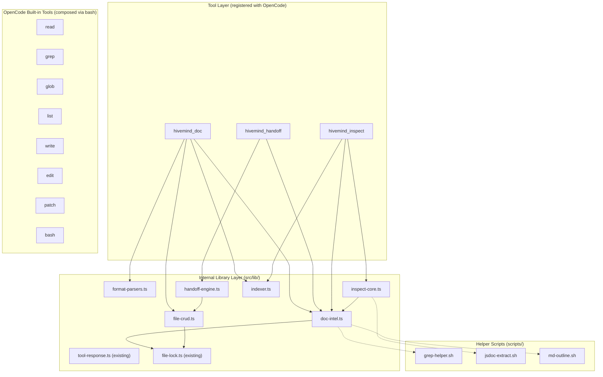

Here is the complete implementation-oriented proposal for the three-tool-group suite, synthesized from both codebases.

---

# HiveMind Custom Tool Suite — Implementation Proposal

## 1. Recommended Architecture

### Layered structure



The architecture boundary from the existing plugin is preserved: `src/lib/` never imports `@opencode-ai/plugin`. Only `src/tools/` touches the SDK. [0-cite-0](#0-cite-0) 

### Why each boundary exists

| Boundary | Reason |
|---|---|
| `src/tools/hivemind-doc.ts` | Plugin SDK surface — registers tool with OpenCode, dispatches actions |
| `src/tools/hivemind-handoff.ts` | Same — separate tool registration, separate concern |
| `src/tools/hivemind-inspect.ts` | Replaces existing inspect tool, adds doc/code inspection |
| `src/lib/doc-intel.ts` | Pure document intelligence — no SDK, no `.hivemind` dependency |
| `src/lib/format-parsers.ts` | Format-specific parsing (MD/XML/JSON/YAML) — reusable |
| `src/lib/file-crud.ts` | Atomic read-before-write, locking, validation — reusable |
| `src/lib/handoff-engine.ts` | Handoff artifact generation, templating — no SDK |
| `src/lib/inspect-core.ts` | Structure/JSDoc/comment extraction — no SDK |
| `src/lib/indexer.ts` | In-memory index building, cross-reference tracking |
| `scripts/` | Shell helpers for grep/jsdoc/outline — invoked via `Bun.$` |

---

## 2. Tool Taxonomy and Naming

### Registration strategy

Using OpenCode's multiple-tools-per-file convention, each file exports named sub-tools. The filename prefix becomes the tool namespace. [0-cite-1](#0-cite-1) 

However, since these are **plugin-provided tools** (not `.opencode/tools/` files), they register via the `tool` key in the `Hooks` return object. The naming uses underscores per the existing convention (`hivemind_doc`, `hivemind_handoff`, `hivemind_inspect`). [0-cite-2](#0-cite-2) 

### Tool taxonomy

```
hivemind_doc          — action-routed document CRUD suite
hivemind_handoff      — delegation/handoff artifact suite  
hivemind_inspect      — inspection/investigation suite (replaces existing)
```

### Sub-tool actions (via `action` enum arg)

**hivemind_doc:**
| Action | Category | Description |
|---|---|---|
| `skim` | Read | Hierarchy/outline of a file or directory |
| `read` | Read | Section-aware read with optional chunking |
| `read_lines` | Read | Offset-based line read (large files) |
| `metadata` | Read | Extract frontmatter/metadata |
| `list` | Read | List documents matching pattern |
| `search` | Read | Structured search with excerpts |
| `index` | Read | Build/query in-memory index |
| `xref` | Read | Cross-reference and link check |
| `write` | Write | Write section/node (read-before-write) |
| `upsert` | Write | Create-or-update section |
| `append` | Write | Append to end of file/section |
| `insert` | Write | Insert after target heading/node |
| `delete` | Write | Delete section/node with preview |
| `create` | Write | Create new document with template |
| `toc` | Write | Generate/update table of contents |
| `batch` | Multi | Batch operations on one file |
| `batch_files` | Multi | Batch operations across files |
| `set_metadata` | Write | Write/update frontmatter |

**hivemind_handoff:**
| Action | Category | Description |
|---|---|---|
| `create` | Write | Create handoff artifact from template |
| `update` | Write | Update handoff record fields |
| `close` | Write | Finalize handoff with validation |
| `list` | Read | List handoff artifacts |
| `read` | Read | Read specific handoff |
| `search` | Read | Search handoffs by criteria |
| `validate` | Read | Validate handoff completeness |
| `resume` | Read | Generate resume context from handoff |
| `template` | Read | Show available templates |

**hivemind_inspect:**
| Action | Category | Description |
|---|---|---|
| `structure` | Read | Hierarchy/skeleton of file(s) |
| `skim` | Read | Quick skim of file or directory |
| `chunk` | Read | Chunked/stepwise read |
| `metadata` | Read | Metadata + links + TOC |
| `links` | Read | Cross-link integrity check |
| `jsdoc` | Code | JSDoc/comment extraction |
| `comments` | Code | Comment extraction and analysis |
| `exports` | Code | Trace exported APIs |
| `compare` | Code | Cross-file comparison |
| `scan` | Legacy | Quick session state snapshot (preserved) |
| `deep` | Legacy | Full context refresh (preserved) |
| `drift` | Legacy | Alignment check (preserved) |

### Collision avoidance

All tool names use the `hivemind_` prefix. OpenCode built-in tools are: `bash`, `edit`, `write`, `read`, `grep`, `glob`, `list`, `patch`, `todowrite`, `todoread`, `webfetch`. No collisions exist. [0-cite-3](#0-cite-3) 

---

## 3. Tool Contracts

### Common argument pattern

Every tool uses the same `action` enum dispatch pattern established by the existing tools: [0-cite-4](#0-cite-4) 

### hivemind_doc contract

```typescript
args: {
  action: tool.schema.enum([
    "skim","read","read_lines","metadata","list","search","index","xref",
    "write","upsert","append","insert","delete","create","toc",
    "batch","batch_files","set_metadata"
  ]),
  path: tool.schema.string().optional()
    .describe("File or directory path (relative to root)"),
  root: tool.schema.string().optional()
    .describe("Root directory override (default: docs/)"),
  section: tool.schema.string().optional()
    .describe("Target section heading or node path (e.g. '## Design' or '/root/item')"),
  content: tool.schema.string().optional()
    .describe("Content for write operations"),
  query: tool.schema.string().optional()
    .describe("Search query or regex pattern"),
  format: tool.schema.enum(["md","xml","json","yaml","yml"]).optional()
    .describe("File format hint (auto-detected if omitted)"),
  offset: tool.schema.number().optional()
    .describe("Line offset for read_lines"),
  limit: tool.schema.number().optional()
    .describe("Max lines/tokens to return"),
  dry_run: tool.schema.boolean().optional()
    .describe("Preview changes without writing"),
  operations: tool.schema.string().optional()
    .describe("JSON array of batch operations"),
}
```

### Structured output contract

All tools return JSON via the existing `toSuccessOutput`/`toErrorOutput` pattern: [0-cite-5](#0-cite-5) 

Extended output shape for doc operations:

```typescript
interface DocToolOutput {
  status: "success" | "error"
  message: string
  entity_id?: string  // file path or section identifier
  metadata?: {
    // Read operations
    outline?: string[]           // heading hierarchy
    content?: string             // extracted content
    line_count?: number
    format?: string
    frontmatter?: Record<string, unknown>
    matches?: Array<{ path: string; line: number; excerpt: string }>
    related?: string[]           // cross-referenced paths
    
    // Write operations  
    diff_preview?: string        // for dry_run
    bytes_written?: number
    hash?: string                // content hash after write
    
    // Batch
    results?: Array<{ action: string; path: string; status: string }>
  }
}
```

### Safety behavior

| Invariant | Implementation |
|---|---|
| Read-before-write | All write actions read current content first, compare, then write |
| File-type safety | Write operations reject files not in `.md,.xml,.json,.yaml,.yml` |
| Large file chunking | Files > 500 lines require `read_lines` with offset; writes use section targeting |
| Atomic writes | Uses existing `withFileLock` from `file-lock.ts` |
| Content hashing | SHA-256 hash returned after writes for revision tracking |
| Dry-run | All write actions support `dry_run: true` returning diff preview | [0-cite-6](#0-cite-6) 

### Standalone vs integrated mode

All tools check for optional `.hivemind` presence but never require it:

```typescript
// Graceful degradation pattern
const hivemindRoot = existsSync(join(directory, '.hivemind')) 
  ? join(directory, '.hivemind') 
  : null

// Use hivemind paths if available, fall back to project root
const defaultRoot = hivemindRoot 
  ? join(hivemindRoot, 'docs') 
  : join(directory, 'docs')
```

---

## 4. File and Artifact Conventions

### Directory hierarchy

```
docs/                          # Default root (configurable)
├── handoffs/                  # Handoff artifacts
│   ├── 2026-03-13/           # Date-based grouping
│   │   ├── 001-auth-audit.md
│   │   └── 002-api-refactor.md
│   └── templates/
│       ├── research.md
│       ├── implementation.md
│       └── audit.md
├── artifacts/                 # General artifacts
├── investigations/            # Inspection outputs
└── index.md                   # Auto-generated index
```

### Naming conventions

| Pattern | Example | Use |
|---|---|---|
| Date-prefix | `2026-03-13-auth-audit.md` | Handoffs, session artifacts |
| Numbered chain | `001-phase-setup.md`, `002-phase-impl.md` | Sequential document series |
| Slug | `auth-middleware-spec.md` | General documents |
| Type prefix | `research-`, `impl-`, `audit-` | Workflow classification |

### Frontmatter convention (YAML)

```yaml
---
type: handoff | artifact | investigation | spec | plan
created: 2026-03-13T10:00:00Z
updated: 2026-03-13T12:00:00Z
session_id: abc-123          # optional
parent_session_id: def-456   # optional
agent: build                 # optional
workflow: research | implementation | audit | delegation
status: draft | active | complete | archived
tags: [auth, middleware]
related:
  - ./002-api-refactor.md
  - ../specs/auth-spec.md
chain: 3                     # position in numbered series
chain_total: 5               # total in series
---
```

---

## 5. Format-Specific CRUD Strategy

### Markdown

| Operation | Strategy |
|---|---|
| Parse structure | Regex heading detection (`^#{1,6}\s`), build heading tree |
| Section read | Find heading, read until next heading of same or higher level |
| Section write | Find heading boundaries, replace content between them |
| Append | Append after last line of target section |
| Insert | Find target heading, insert new section after it |
| Delete | Remove heading and all content until next same-level heading |
| Metadata | Parse YAML frontmatter between `---` delimiters |

### JSON

| Operation | Strategy |
|---|---|
| Parse structure | `JSON.parse`, build key-path tree |
| Node read | Dot-path navigation (`root.items[0].name`) |
| Node write | Deep-set at path, `JSON.stringify` with indent |
| Append | Push to array at path |
| Delete | Delete key at path |
| Validation | `JSON.parse` round-trip after write |

### YAML

| Operation | Strategy |
|---|---|
| Parse structure | Use `yaml` package (already a dependency) |
| Node read | Path navigation through parsed document |
| Node write | Modify parsed tree, serialize back preserving comments where possible |
| Validation | Parse round-trip | [0-cite-7](#0-cite-7) 

### XML

| Operation | Strategy |
|---|---|
| Parse structure | Regex-based tag detection for lightweight ops; full DOM parse for mutations |
| Node read | XPath-like path navigation |
| Node write | Find element boundaries, replace inner content |
| Validation | Well-formedness check after write |

---

## 6. Search, Read, Inspect, and Context-Retrieval Strategy

### Hierarchy-first workflow


The agent should always start with `skim` to get the outline, then narrow down. This is enforced by making `skim` return actionable section identifiers that can be passed directly to `read`.

### Chunking rules

| File size | Strategy |
|---|---|
| < 200 lines | Full read allowed |
| 200-1000 lines | Section-targeted read preferred, full read allowed with warning |
| > 1000 lines | `read_lines` with offset required; section read with auto-chunking |

Token budget: `limit` parameter caps output. Default 200 lines for `read`, 50 lines for `search` excerpts.

### Indexing

`index` action builds an in-memory index of:
- File paths and their headings/structure
- Frontmatter metadata
- Cross-references (links between documents)
- Last-modified timestamps

The index is ephemeral (rebuilt on demand) — no persistent index file that could go stale.

### Cross-reference handling

`xref` action:
1. Scans target file for markdown links, YAML `related:` fields, XML hrefs
2. Validates each reference exists
3. Returns: valid links, broken links, orphaned files (files with no inbound references)

---

## 7. Handoff System Design

### Artifact schema

```yaml
---
type: handoff
handoff_id: hoff-2026-03-13-001
session_id: abc-123
parent_session_id: def-456
agent: build
workflow_type: research | implementation | audit | exploration | delegation
task_type: feature | bugfix | refactor | investigation | documentation
objective: "Audit authentication middleware for security vulnerabilities"
requirements:
  - Review all auth middleware files
  - Check for OWASP top 10 vulnerabilities
  - Document findings with file references
criteria:
  success: "All auth files reviewed, findings documented"
  validation: "At least 3 files inspected, no false positives"
status: in_progress | blocked | complete | abandoned
confidence: high | medium | low
created: 2026-03-13T10:00:00Z
updated: 2026-03-13T12:00:00Z
---

## Objective
Audit authentication middleware for security vulnerabilities.

## Requirements
- Review all auth middleware files
- Check for OWASP top 10 vulnerabilities

## Execution Log
### Step 1: File Discovery
- Found 5 auth-related files via `glob **/*auth*`
- Files: [list]

### Step 2: Security Review
- Reviewed `src/middleware/auth.ts` — no issues
- Reviewed `src/middleware/jwt.ts` — FINDING: token not validated

## Findings
1. JWT token validation missing expiry check in `jwt.ts:45`
2. ...

## Unresolved Questions
- Is the rate limiter applied before or after auth?

## Tools Used
- glob, read, grep, hivemind_inspect.jsdoc

## Related Artifacts
- ./002-auth-fix-implementation.md
```

### Sub-session export format

The `close` action generates a finalized `.md` file with all frontmatter fields populated and a validation summary appended:

```yaml
## Validation Summary
- [x] Objective addressed
- [x] All requirements covered  
- [ ] Success criteria met (partial — 4/5 files reviewed)
- Confidence: medium
- Duration: 23 minutes
- Tool calls: 47
```

### Resumability

The `resume` action reads a handoff artifact and generates a compact context block suitable for injection into a new session:

```
<handoff-context id="hoff-2026-03-13-001">
Objective: Audit auth middleware
Status: in_progress (4/5 files reviewed)
Key findings: JWT expiry check missing in jwt.ts:45
Unresolved: Rate limiter ordering
Next steps: Review src/middleware/session.ts
</handoff-context>
```

### Future orchestrator integration points

The handoff system exposes these adapter hooks (not implemented now, just interface stubs):

```typescript
interface HandoffAdapter {
  onHandoffCreated?(handoff: HandoffMeta): Promise<void>
  onHandoffClosed?(handoff: HandoffMeta): Promise<void>
  resolveParentSession?(): Promise<string | null>
  resolveAgentId?(): Promise<string | null>
}
```

These can be wired to `hiveminder` or `hivefiver` orchestrators later.

---

## 8. Safety and Integrity Model

| Principle | Implementation |
|---|---|
| **Read-before-write** | Every write action reads current file content, computes diff, then writes. Enforced in `file-crud.ts` |
| **Atomicity** | `withFileLock()` from existing `file-lock.ts` wraps all write operations |
| **Content hashing** | SHA-256 of file content returned after writes; optional `expected_hash` arg for optimistic concurrency |
| **Validation** | JSON/YAML writes are parse-validated after write; XML checked for well-formedness |
| **Diff/preview** | `dry_run: true` returns unified diff without writing |
| **Malformed fallback** | If a file can't be parsed structurally, fall back to line-based operations with a warning in output |
| **Concurrency** | `proper-lockfile` (already a dependency) prevents TOCTOU races |
| **Large file guard** | Files > 1000 lines: write operations require section targeting, not full-file replacement | [0-cite-8](#0-cite-8) [0-cite-9](#0-cite-9) 

---

## 9. OpenCode Implementation Approach

### Built-in tool composition

| Custom action | Composes with | How |
|---|---|---|
| `hivemind_doc.search` | `grep` + `glob` | Shell out via `Bun.$` to `grep -rn` for speed, then parse results |
| `hivemind_doc.list` | `glob` | Use `Bun.$` glob or `fs.readdir` with pattern matching |
| `hivemind_doc.read` | `read` | Direct `fs.readFile`, not via OpenCode tool (avoids round-trip) |
| `hivemind_doc.write` | `write` | Direct `fs.writeFile` with locking (avoids permission overhead for doc files) |
| `hivemind_inspect.jsdoc` | `bash` | Shell script: `grep -n '@param\|@returns\|@throws' file` |
| `hivemind_inspect.exports` | `bash` + LSP | `grep -n 'export ' file` + optional LSP symbol query |

### Where to use helper scripts

```bash
# scripts/md-outline.sh — fast heading extraction
grep -n '^#' "$1" | head -100

# scripts/jsdoc-extract.sh — JSDoc block extraction  
awk '/\/\*\*/,/\*\//' "$1"

# scripts/grep-helper.sh — structured grep with context
grep -rn --include="*.{md,yaml,yml,json,xml}" "$1" "$2" | head -200
```

These are invoked via `Bun.$` from the tool's `execute` function, following the pattern shown in OpenCode's custom tools docs: [0-cite-10](#0-cite-10) 

### Where LSP should be used

- `hivemind_inspect.exports` — LSP `textDocument/documentSymbol` for accurate export tracing
- `hivemind_inspect.jsdoc` — LSP hover for type information alongside JSDoc
- Not used for document operations (MD/YAML/JSON/XML are not LSP-served)

### When Python is justified

Not needed for MVP. All operations are well-served by TypeScript + shell scripts. Python could be added later for NLP-based document similarity or semantic search if needed.

---

## 10. Examples

### hivemind_doc examples

```
// Skim a directory
hivemind_doc { action: "skim", path: "docs/specs" }
→ { outline: ["docs/specs/auth-spec.md (## Overview, ## Requirements, ## API)", ...] }

// Read a specific section
hivemind_doc { action: "read", path: "docs/specs/auth-spec.md", section: "## Requirements" }
→ { content: "### Functional\n- JWT validation...\n### Non-functional\n- < 50ms latency..." }

// Create a new document
hivemind_doc { action: "create", path: "docs/specs/rate-limit-spec.md", content: "...", format: "md" }
→ { entity_id: "docs/specs/rate-limit-spec.md", hash: "abc123..." }

// Upsert a section (creates if missing, updates if exists)
hivemind_doc { action: "upsert", path: "docs/specs/auth-spec.md", section: "## Status", content: "Complete as of 2026-03-13" }

// Search across docs
hivemind_doc { action: "search", query: "authentication", root: "docs/" }
→ { matches: [{ path: "docs/specs/auth-spec.md", line: 5, excerpt: "...authentication middleware..." }] }

// Batch operations
hivemind_doc { action: "batch", path: "docs/specs/auth-spec.md", operations: '[{"op":"upsert","section":"## Status","content":"Done"},{"op":"append","section":"## Log","content":"- Updated 2026-03-13"}]' }

// Dry-run write
hivemind_doc { action: "write", path: "docs/specs/auth-spec.md", section: "## Overview", content: "New overview", dry_run: true }
→ { diff_preview: "- Old overview text\n+ New overview" }
```

### hivemind_handoff examples

```
// Create a handoff
hivemind_handoff { action: "create", workflow_type: "research", objective: "Audit auth middleware", path: "docs/handoffs/2026-03-13/" }
→ { entity_id: "docs/handoffs/2026-03-13/001-audit-auth-middleware.md" }

// Update during work
hivemind_handoff { action: "update", path: "docs/handoffs/2026-03-13/001-audit-auth-middleware.md", field: "findings", content: "JWT expiry not checked" }

// Close with validation
hivemind_handoff { action: "close", path: "docs/handoffs/2026-03-13/001-audit-auth-middleware.md" }
→ { validation: { objective_met: true, requirements_covered: 4/5, confidence: "medium" } }

// Resume from handoff
hivemind_handoff { action: "resume", path: "docs/handoffs/2026-03-13/001-audit-auth-middleware.md" }
→ { context_block: "<handoff-context>...</handoff-context>" }
```

### hivemind_inspect examples

```
// Structure inspection
hivemind_inspect { action: "structure", path: "src/lib/persistence.ts" }
→ { outline: ["export function createStateManager", "export async function loadConfig", ...], line_count: 245 }

// JSDoc extraction
hivemind_inspect { action: "jsdoc", path: "src/lib/file-lock.ts" }
→ { blocks: [{ function: "withFileLock", params: ["filePath","fn","options"], returns: "Promise<T>", description: "Execute a function with file lock protection" }] }

// Cross-file comment comparison
hivemind_inspect { action: "compare", paths: ["src/lib/persistence.ts", "src/lib/session-engine.ts"], focus: "comments" }

// Legacy: session scan (preserved from existing tool)
hivemind_inspect { action: "scan" }
→ { active: true, sessionId: "...", hierarchy: {...}, metrics: {...} }
```

---

## 11. Implementation Plan

### Phase 1 — MVP (Foundation)

**Files to create:**

| File | Purpose |
|---|---|
| `src/lib/doc-intel.ts` | Core document intelligence: parse, skim, read-section, search |
| `src/lib/format-parsers.ts` | MD/JSON/YAML/XML parsing utilities |
| `src/lib/file-crud.ts` | Atomic read-before-write, locking, hashing |
| `src/tools/hivemind-doc.ts` | Tool registration with actions: `skim`, `read`, `read_lines`, `list`, `search`, `create`, `write`, `metadata` |
| `src/tools/hivemind-inspect.ts` | Extend existing with: `structure`, `skim`, `chunk`, `jsdoc`, `comments` (preserve `scan`, `deep`, `drift`) |
| `scripts/md-outline.sh` | Fast heading extraction |
| `scripts/jsdoc-extract.sh` | JSDoc block extraction |

**Files to modify:**

| File | Change |
|---|---|
| `src/tools/index.ts` | Add exports for `createHivemindDocTool`, update `createHivemindInspectTool` |
| `src/index.ts` | Register `hivemind_doc` in the `tool` object |
| `package.json` | No new dependencies needed (yaml, zod, proper-lockfile already present) |

### Phase 2 — Full CRUD + Handoff

| File | Purpose |
|---|---|
| `src/lib/handoff-engine.ts` | Handoff artifact generation, templates, validation |
| `src/tools/hivemind-handoff.ts` | Tool registration with all handoff actions |
| Add to `hivemind-doc`: | `upsert`, `append`, `insert`, `delete`, `toc`, `set_metadata`, `xref` |
| Add to `hivemind-inspect`: | `exports`, `compare`, `links`, `metadata` |

### Phase 3 — Batch + Index + Integration Adapters

| File | Purpose |
|---|---|
| `src/lib/indexer.ts` | In-memory index, cross-reference graph |
| Add to `hivemind-doc`: | `batch`, `batch_files`, `index` |
| `src/lib/adapters/` | Optional adapter interfaces for hiveminder/hivefiver integration |

### Testing strategy

- Unit tests for `doc-intel.ts`, `format-parsers.ts`, `file-crud.ts` — pure functions, no SDK
- Integration tests for each tool action using mock filesystem (existing test pattern in `tests/`)
- Edge case tests: malformed YAML, empty files, files > 1000 lines, concurrent writes, missing directories

### Risk areas and mitigation

| Risk | Mitigation |
|---|---|
| XML parsing complexity | Start with regex-based lightweight parsing; add full DOM parser only if needed |
| Large file mutations | Enforce section-targeting for files