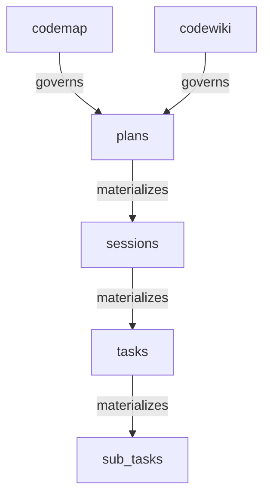

# HiveMind Plugin — Comprehensive Audit Report (SOT for Refactor)

**Date**: 2026-03-07  
**Scope**: `src/`, `.opencode/`, `.hivemind/`, `scripts/`  
**Purpose**: Identify overlaps, conflicts, anti-patterns, and structural debt to serve as Source of Truth for the upcoming refactor.

---

## Table of Contents

1. [System Inventory](#1-system-inventory)
2. [The Dual-Governance Architecture Problem](#2-the-dual-governance-architecture-problem)
3. [Hook Chain Analysis & Conflicts](#3-hook-chain-analysis--conflicts)
4. [State Management Audit](#4-state-management-audit)
5. [Detection Logic Duplication](#5-detection-logic-duplication)
6. [Session Entry vs Mid-Session Lifecycle](#6-session-entry-vs-mid-session-lifecycle)
7. [.hivemind Entity Manifestation & Data Pipeline](#7-hivemind-entity-manifestation--data-pipeline)
8. [Tool & Command Jurisdiction Audit](#8-tool--command-jurisdiction-audit)
9. [Agent Lineage Separation (Hivefiver vs Hiveminder)](#9-agent-lineage-separation)
10. [Cross-Session Workflow & Delegation](#10-cross-session-workflow--delegation)
11. [Guardrails, Gatekeeping & Hierarchical Design](#11-guardrails-gatekeeping--hierarchical-design)
12. [Anti-Patterns & Framework Philosophy Violations](#12-anti-patterns--framework-philosophy-violations)
13. [Edge Case Lifecycle Map](#13-edge-case-lifecycle-map)
14. [Action Priority Matrix](#14-action-priority-matrix)

---

## 1. System Inventory

### 1.1 `src/` — The Runtime Plugin (142 files, 93k tokens compressed)

| Layer | Count | Key Files |
|-------|-------|-----------|
| **Hooks** | 10 files + 1 subdir | `session-lifecycle.ts`, `messages-transform.ts`, `soft-governance.ts`, `tool-gate.ts`, `compaction.ts`, `event-handler.ts`, `sdk-context.ts`, `swarm-executor.ts`, `session_coherence/` |
| **Lib** | 67 files + 4 subdirs | `hierarchy-tree.ts` (40KB), `detection.ts` (29KB), `state-mutation-queue.ts` (28KB), `paths.ts` (22KB), `cognitive-packer.ts` (22KB), `manifest.ts` (18KB), `session-engine.ts` (20KB), `session-governance.ts` (13KB), `injection-orchestrator.ts` (12KB), etc. |
| **Tools** | 18 files | 16 canonical tools (`hivemind_*`) + `index.ts` |
| **Schemas** | 13 files | `brain-state.ts` (27KB), `config.ts` (12KB), `graph-nodes.ts` (17KB), `planning.ts` (7KB), etc. |
| **Scripts** (root) | 9 files | `validate-framework.sh` (26KB), `detect-entry.sh`, `auto-init.sh`, `classify-intent.sh`, `guard-public-branch.sh`, boundary check scripts |

### 1.2 `.opencode/` — Agent Ecosystem & Governance Overlay (142 files, 169k tokens)

| Layer | Count | Key Entities |
|-------|-------|-------------|
| **Agents** | 10 profiles + REGISTRY | hivefiver (30KB), hiveminder (30KB), hivefiver-reserved (29KB), hivemaker (19KB), hiverd (18KB), hiveplanner (12KB), hivehealer (11KB), hivexplorer (12KB), hiveq (11KB), hitea (9KB) |
| **Commands** | 44 files | hivefiver-* (11), hivemind-* (11), hiveq-* (6), hiverd-* (6), gx-* (4), hitea-* (4), compact, hiveminder-orchestrate |
| **Plugins** | 1 (hiveops-governance) | `index.ts`, 6 hook files, `types.ts`, `utils.ts` |
| **Workflows** | 24 YAML + 10 hivefiver MD | bug-remediation, feature-sprint, gx-*, hivefiver-*, hiveq-*, hiverd-*, sequential-delegation, verification-gate |
| **Skills** | 34 directories + registry | entry-protocol, gate-enforcement, delegation-intelligence, hivefiver-*, hiveminder-prime, etc. |
| **Templates** | 11 files + hivefiver/ + planning/ | stage outputs, transition contracts, plan templates, audit/research reports |
| **Tools** (.opencode/tool/) | 4 files | `hiveops_export.ts`, `hiveops_gate.ts`, `hiveops_sot.ts`, `hiveops_todo.ts` |

### 1.3 `.hivemind/` — Runtime State Entities

| Directory | Key Files | Purpose |
|-----------|-----------|---------|
| `state/` | `brain.json` (277KB), `hierarchy.json`, `tasks.json`, `anchors.json`, `manifest.json` | Live brain state, hierarchy tree, task store |
| `graph/` | `tasks.json` (32KB), `mems.json` (6KB), `orphans.json` (26KB), `trajectory.json`, `verification-ledger.json`, `pending-changes.json` | Knowledge graph (tasks, memories, orphaned nodes) |
| `sessions/` | `active/`, `archive/`, `manifest.json`, `active.md`, `index.md` | Session profiles and lifecycle tracking |
| `memory/` | `manifest.json` | Persistent memory store (currently sparse) |
| `handoffs/` | 6 handoff files (JSON+MD pairs) | Cross-session delegation handoffs |
| `config.json` | Root config | governance_mode, language, agent_behavior |
| `manifest.json` | Root manifest | Sub-manifest registry + materialization chain |
| Others | `plans/`, `codemap/`, `codewiki/`, `templates/`, `workflows/`, `logs/`, `docs/`, `checkpoints/`, `project/`, `system/` | Supporting entity stores |

---

## 2. The Dual-Governance Architecture Problem

> [!CAUTION]
> **CRITICAL FINDING**: Two completely independent governance systems register hooks for the SAME event types, creating a parallel execution model with no coordination protocol.

### 2.1 Plugin A: `src/index.ts` → HiveMindPlugin

The **runtime plugin** exported as `HiveMindPlugin`. Registers:

```
event                                → createEventHandler()
experimental.chat.system.transform   → createSessionLifecycleHook()
experimental.chat.messages.transform → createMessagesTransformHook()
tool.execute.after                   → createSoftGovernanceHook()
tool.execute.before                  → createToolGateHook()
experimental.session.compacting      → createCompactionHook()
```

### 2.2 Plugin B: `.opencode/plugins/hiveops-governance/index.ts` → HiveMindGovernance

The **governance overlay plugin**. Registers:

```
event                                → buildEntryGuardHook() + buildEventHook()
experimental.chat.messages.transform → buildIntentClassifierHook() + buildContextInjectionHook()
tool.execute.before                  → buildToolExecuteBeforeHook()
tool.execute.after                   → buildToolExecuteAfterHook()
experimental.session.compacting      → buildCompactionHook()
```

### 2.3 Hook Collision Matrix

| Hook Event | Plugin A (src/) | Plugin B (.opencode/) | Conflict Type |
|------------|-----------------|----------------------|---------------|
| `event` | Session lifecycle (brain state init, session start/end) | Entry guard (`detect-entry.sh`), event routing | **State race**: Both initialize session state independently |
| `messages.transform` | First-turn prompt transform, stop-decision checklist, continuity injection | Intent classification (`classify-intent.sh`), context injection (fallback) | **Injection collision**: Both prepend/mutate messages array |
| `tool.execute.before` | Tool gate (governance logging/warning) | Delegation enforcement (`gx-enforce.sh`), scope checking | **Double-gate**: Both evaluate tool permissions with different criteria |
| `tool.execute.after` | Soft governance (drift detection, chain breaks, violation tracking) | Health compute (every 10 calls), audit, auto-purge | **Metric contention**: Both track turn counts and violations independently |
| `compacting` | Hierarchy preservation, trajectory injection | Handoff purify, schema sync, semantic validate, context retrieve | **Compaction conflict**: Both inject into compacted context |

### 2.4 The Fallback Mitigation (Partial)

The `.opencode/plugins` context-injection hook has a `coreRuntimeHooksPresent()` check:

```typescript
// context-injection.ts line 42
function coreRuntimeHooksPresent(worktree: string): boolean {
  if (process.env.GX_FORCE_PLUGIN_CONTEXT_INJECTION === "1") return false;
  const present = existsSync(join(worktree, "src/hooks/session-lifecycle.ts"))
    && existsSync(join(worktree, "src/hooks/messages-transform.ts"))
  return present;
}
```

> [!WARNING]
> This fallback check only applies to **context-injection** — not to entry-guard, intent-classifier, delegation, compaction, or event handling. Those hooks ALWAYS execute alongside the `src/` hooks.

---

## 3. Hook Chain Analysis & Conflicts

### 3.1 Per-Turn Execution Order (Reconstructed)

For every LLM turn, the following hooks fire **in sequence**:

```
1. event: session.created (Plugin A + Plugin B)
     ├── Plugin A: eventHandler → session state init, brain state load
     └── Plugin B: entryGuardHook → detect-entry.sh → auto-init.sh
                   eventHook → shell script routing

2. messages.transform (Plugin A + Plugin B — BOTH FIRE)
     ├── Plugin A: messagesTransformHook → first-turn session_coherence OR 
     │                                     stop-decision checklist + continuity context
     └── Plugin B: intentClassifierHook → classify-intent.sh (first turn only)
                   contextInjectionHook → fallback context injection (IF coreRuntimeHooksPresent=false)

3. system.transform (Plugin A ONLY)
     └── Plugin A: sessionLifecycleHook → system prompt injection with full brain state context

4. tool.execute.before (Plugin A + Plugin B — BOTH FIRE)
     ├── Plugin A: toolGateHook → governance mode checking, session state validation
     └── Plugin B: toolExecuteBeforeHook → gx-enforce.sh, gx-trace-check.sh

5. tool.execute.after (Plugin A + Plugin B — BOTH FIRE)
     ├── Plugin A: softGovernanceHook → drift detection, chain breaks, off-track intent, violation tracking
     └── Plugin B: toolExecuteAfterHook → periodic health compute, mid-guard, auto-purge

6. compacting (Plugin A + Plugin B — BOTH FIRE)
     ├── Plugin A: compactionHook → hierarchy/trajectory/tactic injection
     └── Plugin B: compactionHook → handoff purify, schema sync, context retrieve
```

### 3.2 Specific Conflict Points

| # | Conflict | Severity | Detail |
|---|----------|----------|--------|
| C1 | **Dual state initialization on session.created** | 🔴 CRITICAL | Plugin A loads `BrainState` from `brain.json`. Plugin B creates independent `EnforcementState`. No shared session ID coordination. |
| C2 | **Dual messages.transform injection** | 🔴 CRITICAL | Both plugins mutate `output.messages`. No ordering guarantee. Plugin B's intent classifier runs even when Plugin A already classifies intent via `session-intent-classifier.ts`. |
| C3 | **Dual tool.execute.before evaluation** | 🟡 HIGH | Plugin A's tool-gate evaluates governance mode + session state. Plugin B evaluates delegation permissions + scope. Both log to different channels. |
| C4 | **Dual tool.execute.after tracking** | 🟡 HIGH | Plugin A tracks turn counts in `BrainState.turnCount`. Plugin B tracks in `EnforcementState.turnCount`. Can drift apart. |
| C5 | **Dual compaction injection** | 🟠 MEDIUM | Both inject into compacted context. Could exceed compaction budget or produce contradictory summaries. |
| C6 | **No `system.transform` from Plugin B** | ℹ️ DESIGN GAP | Plugin B has no system prompt injection, relying entirely on messages.transform. This creates asymmetric governance visibility. |

---

## 4. State Management Audit

### 4.1 State Entity Table

| State Entity | Location | Managed By | Size | Lifecycle |
|-------------|----------|-----------|------|-----------|
| `BrainState` | `.hivemind/state/brain.json` | `src/schemas/brain-state.ts`, `src/lib/state-mutation-queue.ts` | 277KB | Session-scoped, persisted on mutation |
| `EnforcementState` | In-memory (`.opencode/plugins`) | `.opencode/plugins/hiveops-governance/utils.ts` | ~2KB | Plugin lifecycle, optionally file-persisted |
| `HierarchyTree` | `.hivemind/state/hierarchy.json` | `src/lib/hierarchy-tree.ts` | 1.2KB | Cross-session, persisted |
| `GraphState` | `.hivemind/graph/tasks.json`, `mems.json`, `trajectory.json` | `src/lib/graph/writer.ts`, `src/lib/graph-io.ts` | 32KB+6KB+0.5KB | Cross-session, persisted |
| `SessionManifest` | `.hivemind/sessions/manifest.json` | `src/lib/manifest.ts` | ~44B | Cross-session index |
| `Config` | `.hivemind/config.json` | `src/lib/persistence.ts` | 556B | Persistent, user-configured |
| `Manifest` | `.hivemind/manifest.json` | `src/lib/manifest.ts` | 1.3KB | Structural, materialization chain |
| `Anchors` | `.hivemind/state/anchors.json` | `src/lib/anchors.ts` | 41B | Cross-session |

### 4.2 State Management Anti-Patterns

> [!IMPORTANT]
> **AP-1: Two Parallel State Universes**  
> `BrainState` (src/) and `EnforcementState` (.opencode/) track overlapping concepts (session ID, turn count, lineage, violations) independently. No synchronization protocol exists.

> [!WARNING]
> **AP-2: brain.json at 277KB**  
> The brain state file is extremely large.
> This is loaded and saved on nearly every hook invocation.
> Risk of I/O performance degradation, partial writes, and JSON parse failures.

> [!IMPORTANT]
> **AP-3: `state-mutation-queue.ts` complexity (28KB)**  
> The state mutation queue implements a sophisticated deferred-write system, but its complexity makes it difficult to reason about write ordering, especially when both Plugin A and Plugin B trigger mutations in the same turn cycle.

---

## 5. Detection Logic Duplication

### 5.1 `detectOffTrackIntent` — Defined TWICE

| Location | File | Signature | Consumer |
|----------|------|-----------|----------|
| 1 | [messages-transform.ts](file:///Users/apple/hivemind-plugin/src/hooks/messages-transform.ts) | `function detectOffTrackIntent(text: string): string \| null` | Messages transform hook |
| 2 | [soft-governance.ts](file:///Users/apple/hivemind-plugin/src/hooks/soft-governance.ts) | `function detectOffTrackIntent(toolName: string, output: ...): ...` | Tool.execute.after hook |

> [!WARNING]
> **Different signatures, different logic, same name.** One operates on user message text, the other on tool output. Both influence "off-track" detection but are not coordinated.

### 5.2 `detectChainBreaks` — Imported in 5 files

| Consumer File | Import Path |
|--------------|-------------|
| [messages-transform.ts](file:///Users/apple/hivemind-plugin/src/hooks/messages-transform.ts) | `../lib/chain-analysis.js` |
| [soft-governance.ts](file:///Users/apple/hivemind-plugin/src/hooks/soft-governance.ts) | `../lib/chain-analysis.js` |
| [inspect-engine.ts](file:///Users/apple/hivemind-plugin/src/lib/inspect-engine.ts) | `./chain-analysis.js` |
| [session-governance.ts](file:///Users/apple/hivemind-plugin/src/lib/session-governance.ts) | `./chain-analysis.js` |
| [chain-analysis.ts](file:///Users/apple/hivemind-plugin/src/lib/chain-analysis.ts) | Source definition |

While imports are fine, chain-break detection is triggered from **multiple independent locations** in the same turn cycle, potentially creating redundant evaluations.

### 5.3 Intent Classification — THREE independent systems

| System | File | Mechanism |
|--------|------|-----------|
| 1 | `src/lib/session-intent-classifier.ts` | Pattern-matching on message text (TypeScript) |
| 2 | `.opencode/plugins/.../intent-classifier.ts` | Calls `scripts/classify-intent.sh` (shell) |
| 3 | `src/hooks/messages-transform.ts` `detectOffTrackIntent()` | Inline regex pattern matching |

---

## 6. Session Entry vs Mid-Session Lifecycle

### 6.1 Session Entry (New Session)

**Plugin A** (src/) flow:
```
event(session.created) →
  session-lifecycle.ts: load BrainState, detect governance mode →
  messages-transform.ts: first-turn session_coherence (main_session_start.ts) →
  system.transform: full system prompt injection with brain context
```

**Plugin B** (.opencode/) flow:
```
event(session.created) →
  entry-guard.ts: run detect-entry.sh → bootstrap_required? → auto-init.sh → re-detect →
  messages.transform: intent-classifier.ts → classify-intent.sh → persist lineage to profile
```

> [!CAUTION]
> **Race condition at session entry**: Both plugins process `session.created` independently. Plugin A loads `BrainState` and initializes session. Plugin B runs shell scripts and classifies lineage. Neither waits for the other. The session ID may be resolved differently by each.

### 6.2 Mid-Session (Context Pruning & Drift)

**Compaction trigger**: When OpenCode hits token limit → `experimental.session.compacting` fires.

**Plugin A** injects:
- Hierarchy cursor (trajectory → tactic → action)
- Active plan status
- Session continuity markers

**Plugin B** injects:
- Handoff purification (gx-handoff-purify.sh)
- Schema synchronization (gx-schema-sync.sh)
- Context retrieval (gx-context-retrieve.sh)

> [!WARNING]
> **Compaction budget conflict**: No shared budget allocation between the two plugins' compaction injections. The `injection-orchestrator.ts` (12KB) manages budgets but only for the `src/` path. The `.opencode/` compaction hook bypasses this entirely.

### 6.3 Session Resume (After Warmup/Context Window Reset)

The `hivemind_session` tool's `resume` action and `hivemind_context` tool's `resume` action both handle session resumption, but via different code paths:
- `session-lifecycle.ts`: Re-injects system prompt on every turn (stateless per-turn)
- `session_coherence.ts` (19KB): Complex first-turn vs subsequent-turn logic
- `plugin-fallback-context.ts` (11KB): Fallback context when core hooks are absent

---

## 7. .hivemind Entity Manifestation & Data Pipeline

### 7.1 Materialization Chain (from manifest.json)



### 7.2 Entity Lifecycle States

| Entity | Created By | Updated By | Read By | Staleness Detection |
|--------|-----------|-----------|---------|-------------------|
| `brain.json` | `hivemind_session start` | `state-mutation-queue.ts` (every hook cycle) | 5+ hooks, 4+ tools, session-governance | `staleness.ts` |
| `hierarchy.json` | `hivemind_hierarchy` tool | `hierarchy-tree.ts` prune/branch | system.transform, compaction, inspect | None (manual check) |
| `graph/tasks.json` | `hivemind_declare` tool | `graph/writer.ts` | `graph/reader.ts`, `detect-engine.ts` | `staleness.ts` via BrainState refs |
| `graph/mems.json` | `hivemind_memory` tool | `graph/writer.ts` | `graph/reader.ts`, context injection | None |
| `graph/trajectory.json` | `hivemind_hierarchy` | `hierarchy-tree.ts` | compaction, session-lifecycle | None |
| `sessions/active/` | `hivemind_session start` | `session-engine.ts`, `manifest.ts` | session-lifecycle, session-export | `stale_session_days` config |
| `handoffs/` | `hivemind_cycle export` | Manual / tool | Cross-session resume | Time-based |
| `config.json` | CLI init / `hivemind_bootstrap` | User-driven | Every hook invocation (re-read from disk per Rule 6) | N/A (user-managed) |

### 7.3 Entity Read/Write Authority Violations

> [!IMPORTANT]
> **V-1: brain.json has 5+ writers** — `state-mutation-queue.ts`, `session-engine.ts`, `session-governance.ts`, `soft-governance.ts`, and `messages-transform.ts` all queue mutations. The queue serializes writes, but the **number of independent trigger points** makes reasoning about state difficult.

> [!WARNING]
> **V-2: graph/ has no write-through validation** — `graph/writer.ts` writes directly without schema validation against `graph-nodes.ts` schemas at write time. Validation is deferred to `fk-validator.ts` which runs reactively.

> [!IMPORTANT]
> **V-3: Orphaned entities accumulate** — `graph/orphans.json` is 26KB (larger than `mems.json` at 6KB). The `orphan-quarantine.ts` (2.3KB) module exists but appears passive — it quarantines but doesn't auto-resolve.

---

## 8. Tool & Command Jurisdiction Audit

### 8.1 Tool Overlap Matrix (src/tools vs .opencode/tool)

| Domain | src/tools | .opencode/tool | .opencode/commands | Overlap? |
|--------|----------|----------------|-------------------|----------|
| **Session management** | `hivemind_session` (start/update/close/status/resume) | — | `hivefiver-start`, `hivemind-status` | 🟡 Commands duplicate tool actions |
| **Inspection** | `hivemind_inspect` (scan/deep/drift) | — | `hivemind-scan`, `hivemind-lint`, `hivefiver-audit` | 🟡 Commands wrap tool or duplicate logic |
| **Memory** | `hivemind_memory` (save/recall/list) | — | `hivemind-context` | 🟡 Partial overlap |
| **Task/TODO governance** | — | `hiveops_todo.ts` | — | ℹ️ `.opencode` only |
| **SOT governance** | — | `hiveops_sot.ts` | — | ℹ️ `.opencode` only |
| **Gate enforcement** | `hivemind_context` (validate) | `hiveops_gate.ts` | `hiveq-gate-check`, `hivefiver-audit` | 🔴 Triple overlap |
| **Export/Handoff** | `hivemind_cycle` (export/list/prune) | `hiveops_export.ts` | `hivemind-delegate`, `hivemind-pre-stop` | 🔴 Triple overlap |
| **Plan management** | `hivemind_plan` (create/status/update/validate/link) | — | `hivefiver-plan-spawn`, `hivefiver-spec`, `hivefiver-architect` | 🟡 Commands specialize tool actions |
| **Bootstrap** | `hivemind_bootstrap` | — | `hivefiver-start`, `hivefiver-discovery`, `hivefiver-intake` | 🟡 Hivefiver commands have own bootstrap flow |
| **Code intelligence** | `hivemind_codemap`, `hivemind_read_skeleton`, `hivemind_precision_patch`, `hivemind_doc_weaver`, `hivemind_mesh_pull` | — | — | ✅ No overlap |
| **Ideation** | `hivemind_ideate` | — | — | ✅ No overlap |

### 8.2 Anti-Pattern: Commands That Should Be Tool Actions

The following `.opencode/commands` are imperative scripts that **should be actions within canonical tools** to maintain the tool-centric governance model:

- `hivemind-compact.md` → should be `hivemind_context compact`
- `hivemind-dashboard.md` → should be `hivemind_inspect dashboard`
- `hivemind-debug-trigger.md` → should be `hivemind_inspect debug`
- `hivemind-debug-verify.md` → should be `hivemind_inspect verify`
- `hivemind-delegate.md` → should be `hivemind_session delegate`

---

## 9. Agent Lineage Separation

### 9.1 The Two Lineages

| Lineage | Anchor Agent | Domain | Session Pattern |
|---------|-------------|--------|----------------|
| **Hivefiver** | `hivefiver.md` (30KB) | End-user project execution (build, spec, architect, audit, doctor) | Guided multi-stage workflows (intake → discovery → spec → architect → build → audit) |
| **Hiveminder** | `hiveminder.md` (30KB) | Framework governance orchestration, delegation, cross-session management | Supreme coordinator, switchboard routing, agent ecosystem management |

### 9.2 Lineage Classification Chain

```
Session Entry →
  1. scripts/detect-entry.sh → determines entry_condition (bootstrap_required / classify_required / ready)
  2. scripts/classify-intent.sh → pattern-matches first user message → returns "hivefiver" or "hiveminder"
  3. .opencode/plugins intent-classifier.ts → persists to session profile
  4. src/lib/session-intent-classifier.ts → redundant pattern matching (internal)
  5. src/lib/runtime-session-lineage.ts → resolves lineage for runtime context
```

> [!WARNING]
> **Lineage is classified by 3 independent mechanisms** (shell script, plugin hook, internal lib) with no single source of truth for the resolved lineage. Each may produce different results.

### 9.3 Agent Awareness Gaps

| Issue | Detail |
|-------|--------|
| **Sub-session agent identity** | When a main session delegates to a sub-agent (e.g., hiveminder → hivexplorer), the sub-session may not inherit lineage. The `swarm-executor.ts` (2.7KB) has minimal lineage propagation. |
| **Agent role not captured in hooks** | The `chat.params` hook (which captures agent ID) is not registered by either Plugin A or Plugin B. This is a documented constraint (PP-01 in knowledge). |
| **Reserved agent (hivefiver-reserved.md)** | A 29KB reserved agent profile exists but serves unknown purpose — potential dead code or future placeholder. |

---

## 10. Cross-Session Workflow & Delegation

### 10.1 Delegation Pipeline

```
Main Session (hiveminder) →
  hivemind_session delegate →
    session-split.ts → creates child session →
      swarm-executor.ts → launches sub-agent →
        handoffs/ → stores delegation packet (JSON+MD) →
          hivemind_cycle export → captures session state for next session
```

### 10.2 Cross-Session Awareness Issues

| # | Issue | Severity |
|---|-------|----------|
| D1 | `handoffs/` are write-only — no automated pickup mechanism | 🔴 CRITICAL |
| D2 | `EnforcementState.delegationChain` is in-memory only — lost on plugin restart | 🟡 HIGH |
| D3 | `sequential-delegation-workflow.yaml` (7KB) defines a complex multi-step delegation flow but is YAML-declarative with no runtime interpreter | 🟡 HIGH |
| D4 | Session manifest (`sessions/manifest.json`) is 44 bytes (empty `{}` or `[]`) — the session index is not maintained | 🟠 MEDIUM |
| D5 | No parent→child session ID linkage in `BrainState` — `session.opencode_session_id` is a single string | 🟠 MEDIUM |

---

## 11. Guardrails, Gatekeeping & Hierarchical Design

### 11.1 Guardrail Layers

| Layer | Implementation | Effectiveness |
|-------|---------------|---------------|
| **Shell script boundary checks** | `check-sdk-boundary.sh`, `check-state-write-boundary.sh`, `check-docs-ownership-boundary.sh`, `check-agent-registry-parity.sh` | CI/pre-commit only — not runtime |
| **Tool gate (src/)** | `tool-gate.ts` — logs warnings based on governance mode | Soft enforcement only — cannot block tool execution (SDK limitation) |
| **Delegation enforcement (.opencode/)** | `hiveops_gate.ts`, delegation hook — checks scope before tool execution | Runtime but in parallel plugin — may not coordinate with src/ gate |
| **SOT governance (src/)** | `sot-governance.ts` (11KB) — validates artifact authority | Triggered by tools, not hooks — agents must explicitly invoke |
| **Hierarchy guard** | `hierarchy-tree.ts` — prune, branch, validate | Comprehensive but complex (40KB) — risk of bugs in edge cases |
| **Schema validation** | `schemas/brain-state.ts` (27KB) — Zod schemas | At parse time, not at write time |

### 11.2 Gatekeeping Gaps

| Gap | Detail | Impact |
|-----|--------|--------|
| **G1** | No `chat.params` hook means agent identity cannot be captured until first tool call or message classification | Agent-specific guardrails delayed until mid-turn |
| **G2** | Sub-agent tools bypass ALL plugin hooks (documented PP-01) | Sub-agents operate without governance |
| **G3** | The `validate-framework.sh` (26KB) is a comprehensive validator but runs manually — not integrated into any hook | Stale validation |
| **G4** | `guard-public-branch.sh` protects git branches but is CI-only, not runtime-enforced | Limited to git push protection |

---

## 12. Anti-Patterns & Framework Philosophy Violations

### 12.1 Against "Enforce, Don't Document" Principle

| # | Anti-Pattern | Violation |
|---|-------------|-----------|
| AP-1 | **44 command files as markdown instruction docs** — most are prompt templates, not executable enforcement | Commands instruct agents but don't enforce behavior |
| AP-2 | **Workflow YAML files are declarative-only** — no runtime interpreter executes them | Workflows document processes but don't enforce execution order |
| AP-3 | **34 skill directories define capabilities** — but skill selection is agent-discretionary, not role-enforced | Skills exist as suggestions, not constraints |

### 12.2 Against "Binary Permission Model"

| # | Anti-Pattern | Violation |
|---|-------------|-----------|
| AP-4 | **Tool gate cannot block** — SDK limitation means governance is warning-only | Permission model is ternary (allow/warn/log), not binary |
| AP-5 | **SOT governance is tool-invoked, not hook-enforced** — agents must choose to validate | Governance is opt-in, not mandatory |

### 12.3 Against "Context-First Delivery"

| # | Anti-Pattern | Violation |
|---|-------------|-----------|
| AP-6 | **277KB brain.json loaded on every turn** — far exceeds token-efficient delivery | Context bloat from historical accumulation |
| AP-7 | **Dual injection via messages.transform** — both plugins inject, with no shared budget | Context overflow risk |
| AP-8 | **26KB orphans.json growing unbounded** — orphaned nodes never resolved | Dead context accumulates |

### 12.4 Against "Single Source of Truth"

| # | Anti-Pattern | Violation |
|---|-------------|-----------|
| AP-9 | **Triple intent classification** — shell script, plugin hook, internal lib | 3 sources, no reconciliation |
| AP-10 | **Dual state tracking** — BrainState + EnforcementState | 2 truth stores for same concepts |
| AP-11 | **Tool + Command overlap** — gate enforcement in tool, command, AND plugin | 3 enforcement paths for same concept |

---

## 13. Edge Case Lifecycle Map

### 13.1 Greenfield Project Entry

```
User opens OpenCode on empty project →
  detect-entry.sh → state_exists=false, entry_condition=bootstrap_required →
  auto-init.sh → creates .hivemind/ scaffold →
  detect-entry.sh (re-run) → entry_condition=classify_required →
  classify-intent.sh → "hivefiver" (build project intent) →
  
  PARALLEL:
    Plugin A: session-lifecycle loads empty BrainState, creates session
    Plugin B: entry-guard persists to EnforcementState
    
  First turn: system.transform injects minimal context →
  messages.transform: session_coherence first-turn prompt →
  Agent selects hivefiver → hivefiver-start → hivefiver-discovery → ...
```

### 13.2 Brownfield Project Resume

```
User opens OpenCode on existing project with .hivemind/ →
  detect-entry.sh → state_exists=true, entry_condition=ready →
  
  PARALLEL:
    Plugin A: session-lifecycle loads existing BrainState (277KB parse)
    Plugin B: entry-guard reads enforcement state, skips bootstrap
    
  classify-intent.sh → may misclassify based on first message →
  system.transform: full context with hierarchy, graph, plans →
  RISK: context overflow from large brain.json + messages.transform injection
```

### 13.3 Mid-Session Compaction

```
Token limit hit → experimental.session.compacting fires →
  PARALLEL:
    Plugin A compaction: hierarchy cursor + trajectory injection
    Plugin B compaction: gx-handoff-purify.sh + gx-schema-sync.sh + gx-context-retrieve.sh
    
  RISK: Both inject into compacted context without coordinated budget →
  Post-compaction: system.transform re-fires → injects full system prompt again →
  messages.transform: stop-decision checklist re-injected →
  RISK: duplicated instructions from both pre-compaction and post-compaction injection
```

### 13.4 Sub-Session Delegation

```
Main session (hiveminder) decides to delegate →
  hivemind_session delegate → creates handoff in handoffs/ →
  swarm-executor.ts → launches child session →
  
  CRITICAL: child session hooks DO NOT FIRE (PP-01) →
  Child session operates WITHOUT:
    - Tool gate enforcement
    - Drift detection
    - State tracking
    - Lineage awareness
    
  On child completion → results may not be picked up by main session →
  handoffs/ files accumulate without cleanup
```

### 13.5 New Session After Context Drift

```
User starts new session on same project →
  detect-entry.sh → state_exists=true, old brain.json from previous session →
  
  RISK: previous session's BrainState contains stale turn counts, 
        completed trajectory items, and historical violations
        
  classify-intent.sh → new intent may conflict with old trajectory →
  session-lifecycle: loads old BrainState → attempts to continue old trajectory →
  
  SHOULD: Create new session record, archive old BrainState, fresh start
  ACTUAL: May continue old session state without cleanup
```

---

## 14. Action Priority Matrix

### 🔴 P0 — Must Fix (Architectural Blockers)

| # | Action | Effort | Impact |
|---|--------|--------|--------|
| **R1** | **Unify governance into single plugin** — merge `.opencode/plugins/hiveops-governance` into `src/` or vice versa. Eliminate dual hook registrations. | L | Eliminates all C1-C6 conflicts |
| **R2** | **Single state store** — merge EnforcementState concepts into BrainState or extract a shared StateManager | M | Eliminates AP-10 |
| **R3** | **Single intent classification** — pick one mechanism (TypeScript lib), remove shell script and plugin classifier | S | Eliminates AP-9 |
| **R4** | **Implement brain.json compaction** — cap at ~20KB with archival of historical turns, old violations, stale entity refs | M | Fixes AP-6, AP-8 |

### 🟡 P1 — Should Fix (Functionality Gaps)

| # | Action | Effort | Impact |
|---|--------|--------|--------|
| **R5** | **Implement handoff pickup** — automated mechanism to load delegation handoffs into new sessions | M | Fixes D1 |
| **R6** | **Add `chat.params` hook** — capture agent identity at turn start, not after first tool call | S | Fixes G1 |
| **R7** | **Persist delegation chain** — store in `.hivemind/sessions/active/<id>/delegation.json` | S | Fixes D2 |
| **R8** | **Parent-child session linking** — add `parent_session_id` to BrainState, cross-reference in session manifest | S | Fixes D5 |

### 🟠 P2 — Should Improve (Quality & Maintainability)

| # | Action | Effort | Impact |
|---|--------|--------|--------|
| **R9** | **Consolidate tool + command overlap** — remove 5-10 commands that duplicate tool actions | M | Fixes AP-1 |
| **R10** | **Schema validation at write time** — validate brain.json mutations before persistence, not after parse | M | Fixes V-2 |
| **R11** | **Orphan auto-resolution** — scheduled cleanup of orphans.json entries, not just quarantine | S | Fixes AP-8, V-3 |
| **R12** | **Workflow runtime interpreter** — convert YAML declarations into executable workflow steps | L | Fixes AP-2 |
| **R13** | **Remove hivefiver-reserved.md** or document its purpose | XS | Code hygiene |

---

> *This audit report is the Source of Truth for the HiveMind refactor. All changes should reference specific finding IDs (C#, AP-#, D#, G#, V-#, R#) from this document.*
